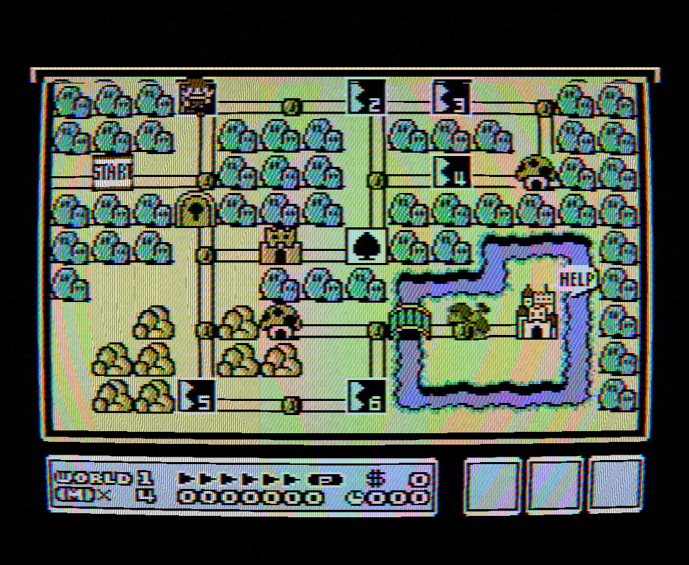

# AprNes CRT 電視模擬功能介紹

## 前言

在 LCD 螢幕普及之前，所有家用遊戲機都透過「類比訊號」連接到 CRT（映像管）電視。NES 輸出的並不是我們今天熟悉的數位像素畫面，而是一種叫做 **NTSC 複合視訊**的電波訊號——和當年的電視台廣播用的是同一套標準。

這意味著，NES 遊戲在設計時，美術師看到的畫面天生就帶有 CRT 電視的種種「不完美」：模糊的色彩過渡、掃描線的明暗條紋、螢幕邊緣的色偏……這些並非缺陷，而是遊戲視覺體驗的一部分。許多遊戲的美術甚至刻意利用了這些特性。

AprNes 的類比模式完整模擬了這條從 NES 到 CRT 電視的訊號鏈，重現當年的視覺體驗。

### 效果展示



*Level 3 UltraAnalog + RF 端子的完整效果。可以觀察到：掃描線紋理（水平明暗條紋）、高光 Bloom（亮色區域掃描線間隙被填亮）、螢幕曲率（邊緣微彎）、邊緣暗角（四周漸暗）、色彩模糊（色塊邊界柔和漸變）、RF 雪花雜訊（細微的亮度閃爍）、蔭罩（放大可見 RGB 磷光條紋）。這些效果全部來自物理模擬的自然結果，不是影像濾鏡。*

---

## 技術亮點：物理模擬 vs 影像濾鏡

市面上大多數模擬器的「CRT 效果」本質上是 **影像後處理濾鏡**——先渲染出乾淨的數位像素畫面，再用模糊、疊加掃描線紋理、加上雜訊等方式「裝飾」成 CRT 的樣子。這就像在照片上套一個復古濾鏡：看起來有那個味道，但細節經不起推敲。

AprNes 採取完全不同的路線：**從電路層面模擬真實的物理過程**。

### 真正的 NTSC 訊號生成與解調

AprNes 不是在數位像素上「畫」出類比效果，而是真的把 NES 的調色盤數據轉換成 **21.477 MHz 的 NTSC 複合波形**——每個像素產生 4 個取樣點，每條掃描線就是 1024 個浮點數組成的時域波形。然後再用真實電視的方法把這個波形「解碼」回去：

- **Hann 窗 FIR 相干解調**：亮度（Y）用 6-tap 窗，色差 I 用 18-tap，Q 用 54-tap——這和真實電視晶片裡的帶通濾波器做的是同一件事
- **IIR 低通濾波**：SlewRate 和 ChromaBlur 模擬的是電容和電感構成的類比電路的頻率響應

這代表 dot crawl、色彩滲透、亮度模糊這些現象不是「加上去」的效果，而是訊號處理過程中**自然湧現**的物理結果。如果你改變訊號參數（比如切換 RF / AV / S-Video），所有這些現象的強度都會跟著連動變化——因為它們本來就是同一組物理方程式的不同面向。

### 振鈴效應來自二階動力學，不是邊緣偵測

濾鏡式的做法通常是偵測明暗邊緣，然後在旁邊「畫」一條亮線。AprNes 的振鈴效應來自一個**阻尼彈簧模型**——訊號追蹤器有「速度」和「慣性」，遇到急劇的訊號變化時會衝過目標值再彈回來，就像真實電路中電感和電容的暫態響應。振鈴的形狀、頻率、衰減速度都是物理方程式自然決定的，而不是手動畫上去的。

### RF 魚骨紋來自真實的振盪器

RF 模式的斜向干擾條紋不是貼上去的紋理圖案。程式內部有一個 **4.5 MHz 遞迴正弦振盪器**（recursive oscillator），它以精確的物理頻率逐取樣點旋轉相位，同時受 60 Hz 音訊包絡調制。產生的干擾訊號直接疊加到複合波形上，再一起通過解調和濾波——所以魚骨紋會和畫面內容交互作用，穿過色彩邊界時形態會改變，就像真實 RF 干擾的樣子。

### Emphasis 位元的方向性衰減

NES 的 emphasis 功能（畫面偏紅/偏綠/偏藍）在硬體層面是透過降低副載波特定相位的電壓來實現的。多數模擬器簡化為「整體亮度乘以係數」，但 AprNes 建立了 **8 種 emphasis 組合 × 12 相位的衰減查表**，再透過 Fourier 分解預計算出每種組合的精確 YIQ 值。結果是 emphasis 不只改變亮度，還會以正確的方向影響色相和飽和度。

### 掃描線是高斯光斑，不是條紋圖案

濾鏡式掃描線通常是每隔一行加一條半透明黑線。AprNes 的掃描線來自**電子束光斑的高斯分布模型** `exp(-dy²/2σ²)`——每條掃描線的亮度從中心向上下衰減，衰減的形狀由光束聚焦程度（σ）決定。搭配 Bloom 效應，高亮度的掃描線會自然地「脹開」填滿間隙，低亮度的則保持分明——這就是為什麼 CRT 上明亮的白色文字看起來幾乎沒有掃描線，而深色背景的掃描線卻很明顯。

### 磷光體餘輝是逐通道衰減

磷光體餘輝不是簡單的運動模糊（混合前後幀）。CRT 螢幕上 R/G/B 三種磷光體的衰減是獨立的——紅色磷光體可能衰減得比藍色快。AprNes 的實作是 **per-channel `max(current, previous × decay)`**：每個顏色通道獨立比較當前幀和上一幀的衰減值，取較亮的那個。這意味著：
- 殘影的色彩會隨衰減逐漸偏移（因為各通道衰減速度不同）
- 物體移動方向上是拖尾，不是前後對稱的模糊
- 靜止畫面完全不受影響（max 保證不會變暗）

### 匯聚偏差遵循 CRT 幾何學

電子槍匯聚偏差不是全螢幕均勻的 RGB 偏移。真實 CRT 中，三支電子槍呈三角形排列，螢幕中心的匯聚由工廠精密校準，但邊緣無法完美補償。AprNes 的實作讓偏移量**隨像素到螢幕中心的距離線性遞增**——正中央是零偏差（完美匯聚），越靠近邊緣 R 和 B 通道的水平位移越大。這符合真實 CRT 的幾何光學。

### 端子差異來自同一組物理模型

RF、AV、S-Video 三種連接方式不是三套獨立的濾鏡預設。它們共用同一條訊號處理管線，只是物理參數不同——RF 有更多雜訊和更窄的頻寬，S-Video 完全分離亮度和色度所以沒有 dot crawl。切換端子時，所有效果的變化是連貫的、物理一致的，而不是「切換到另一組手調參數」。

### 三層級渲染架構

AprNes 提供三種渲染層級，從乾淨的數位像素到完整的物理模擬，使用者可以依照偏好和硬體效能自由切換：

**Level 1 — 數位像素（Analog OFF）**

關閉類比模式。NES 的調色盤值直接轉換為 RGB 像素輸出，畫面銳利、色塊分明，就是一般模擬器預設的樣子。適合追求清晰畫面或低階硬體的使用者。沒有任何訊號處理或 CRT 效果。

**Level 2 — 快速類比（Analog ON，UltraAnalog OFF）**

開啟類比模式的快速路徑。NES 的調色盤值先查表轉換為 YIQ 色彩空間，搭配 6 點副載波相位 LUT 模擬 dot crawl，再透過 IIR 濾波器輸出到螢幕。速度是 Level 3 的數倍，已經具備 dot crawl、色彩模糊、亮度響應延遲、振鈴、HBI 等訊號層效果，以及 RF 雜訊和魚骨紋。

這個層級**不經過 CRT 顯示層**——沒有掃描線、Bloom、蔭罩、磷光餘輝、螢幕曲率等電視端效果。畫面看起來像是「把類比訊號直接數位化」，有訊號的味道但沒有電視的質感。適合想要 NTSC 色彩特性但不需要 CRT 外觀的使用者。

**Level 3 — UltraAnalog 完整物理模擬（Analog ON，UltraAnalog ON）**

最高精度的完整模擬。先生成 21.477 MHz 的 NTSC 複合波形（每個像素 4 個取樣點），再用 Hann 窗 FIR 相干解調分離 Y/I/Q，輸出到線性 RGB 緩衝區。然後經過 CRT 顯示層（Stage 2），施加掃描線光斑、Bloom、水平擴散、磷光餘輝、蔭罩、匯聚偏差、螢幕曲率等所有電視端效果。

這是本文介紹的所有物理效果完整運作的層級。訊號從「NES 硬體輸出」到「CRT 螢幕上的光」，每一個環節都有物理對應。效能消耗最高，但也是最接近真實體驗的模式。

**三個層級的關係**：

```
Level 1:  NES 調色盤 ──→ RGB 像素 ──→ 螢幕
Level 2:  NES 調色盤 ──→ YIQ 查表 ──→ IIR 濾波 ──→ RGB 像素 ──→ 螢幕
Level 3:  NES 調色盤 ──→ 21MHz 波形 ──→ FIR 解調 ──→ 線性 RGB ──→ CRT 顯示層 ──→ 螢幕
                         Stage 1                                    Stage 2
```

每升一級，模擬的物理環節就多一層，畫面的真實感也更進一步。但即使是 Level 2，也已經遠超大多數模擬器的 Blargg LUT 濾鏡——因為它有完整的 IIR 狀態延續和二階振鈴動力學。

---

## 與常見 NTSC / CRT 濾鏡的比較

市面上有幾種廣為人知的 NTSC 或 CRT 效果方案。以下比較它們的原理差異，說明為什麼 AprNes 的做法在物理正確性上有本質的不同。

### Blargg NTSC Video Filter（nes_ntsc / snes_ntsc）

由 Shay Green（blargg）開發的 NTSC 濾鏡函式庫，是目前使用最廣泛的方案，被 Nestopia、Mesen 等知名模擬器採用。

**原理**：預先計算一張巨大的查找表（LUT），對每一對相鄰的 NES 調色盤值，直接查出混合後的 RGB 輸出。每個 NES 像素固定輸出 3 個螢幕像素。

**它做到的**：
- Dot crawl（色彩爬動）
- 相鄰像素間的色彩混合（composite artifact colors）
- 基本的亮度/色度分離殘留

**它做不到的**：
- **沒有 IIR 狀態延續**：每對像素的計算是獨立的，不存在「上一個像素的濾波器狀態」。真實電視的類比電路有記憶——前一個像素的亮暗會影響下一個像素的起始狀態，Blargg 的查表無法表現這一點
- **沒有 CRT 顯示效果**：不包含掃描線、Bloom、蔭罩、磷光餘輝等任何電視端的模擬。它只處理「訊號解碼」，不處理「螢幕顯示」
- **固定解析度**：輸出永遠是 3:1 比例，無法調整
- **無 RF 特有效果**：沒有雜訊、魚骨紋、音訊干擾
- **無振鈴 / 無 HBI**：查表無法產生暫態響應

Blargg 的濾鏡是優秀的快速近似方案，但本質上是「用查表模擬結果」，而非「重現產生結果的物理過程」。

> **趣聞**：AprNes 的訊號源使用了 blargg 研究的 NES PPU 電壓準位數據（loLevels / hiLevels），這是目前最精確的 NES 類比輸出測量值。Blargg 的 LUT 濾鏡和 AprNes 的時域模擬共享同一個訊號源頭，但走了完全不同的解碼路線。

### RetroArch CRT Shader（CRT-Royale / CRT-Geom / zfast-crt）

RetroArch 平台提供一系列 GPU shader 形式的 CRT 效果，其中最知名的是 CRT-Royale（最完整）和 CRT-Geom（輕量級）。

**原理**：在 GPU 上對**已經解碼完成的數位 RGB 畫面**進行後處理——疊加掃描線紋理、Gaussian blur 模擬 Bloom、barrel distortion 模擬曲率、紋理貼圖模擬蔭罩。

**它做到的**：
- 掃描線、Bloom、螢幕曲率、蔭罩
- CRT-Royale 額外有 halation（光暈）和 phosphor mask
- 視覺效果在靜態截圖上可以很逼真

**它做不到的**：
- **完全沒有 NTSC 訊號域模擬**：它處理的輸入是乾淨的數位像素，所以不會有 dot crawl、色彩模糊、亮度延遲等任何訊號層的效果。一個紅色方塊旁邊的黑色背景，在 shader 處理後仍然是銳利的邊界——真實 CRT 上不可能出現這種東西
- **掃描線是「畫」上去的**：通常是每隔 N 行乘以一個正弦或階梯函數來壓暗，不考慮亮度。真實掃描線的間隙亮度和像素亮度有關——亮的地方間隙被 Bloom 填滿，暗的地方間隙明顯
- **沒有幀間狀態**：部分 shader 架構不支援讀取前一幀的結果，無法實現 phosphor persistence

有些使用者會把 Blargg NTSC 濾鏡和 CRT shader 串聯使用（先 Blargg 處理訊號，再 shader 處理顯示）。這比單獨使用好，但兩個階段的參數是各自獨立調整的，不像真實硬體那樣由同一組物理定律連貫驅動。

### 其他模擬器的內建 NTSC 效果

多數模擬器（FCEUX、Mesen 等）的 NTSC 效果直接呼叫 Blargg 的 nes_ntsc 函式庫，本質上與上述分析相同。少數模擬器有自己的實作，但通常也是查表或簡化的 FIR 濾波。

### 比較總結

| 特性 | Blargg LUT | CRT Shader | Blargg + Shader | **AprNes Lv2** | **AprNes Lv3** |
|------|:----------:|:----------:|:---------------:|:--------------:|:--------------:|
| NTSC 訊號域模擬 | 查表近似 | 無 | 查表近似 | **IIR 時域** | **FIR+IIR 時域** |
| IIR 狀態延續 | 無 | 無 | 無 | **全掃描線** | **全掃描線** |
| Dot crawl | 有 | 無 | 有 | **自然湧現** | **自然湧現** |
| 振鈴 / Gibbs | 無 | 無 | 無 | **二階動力學** | **二階動力學** |
| 掃描線 | 無 | 正弦疊加 | 正弦疊加 | 無 | **高斯光斑** |
| Bloom（亮度相依） | 無 | 部分 | 部分 | 無 | **物理連動** |
| 磷光體餘輝 | 無 | 少數支援 | 少數支援 | 無 | **逐通道衰減** |
| RF 干擾 | 無 | 無 | 無 | **4.5MHz 振盪器** | **4.5MHz 振盪器** |
| 端子切換 | 固定 | 無 | 手動切預設 | **同一管線** | **同一管線** |
| 訊號↔顯示連貫性 | — | — | 分離 | 訊號層完整 | **兩階段物理一致** |

AprNes 的核心差異不在於「效果更多」，而在於**所有效果都是同一套物理方程式的不同面向**。調一個參數，所有相關現象自然跟著變——因為真實世界就是這樣運作的。即使是較快的 Level 2，在訊號層的物理正確性上也已經超越 Blargg LUT 方案。Level 3 則進一步加入完整的 CRT 顯示層，實現從訊號到螢幕的全鏈路物理模擬。

---

## 訊號鏈總覽

以下是 Level 3（UltraAnalog）的完整訊號鏈——也就是真實硬體的完整路徑：

```
NES 主機 → NTSC 編碼 → 傳輸線（RF/AV/S端子）→ CRT 電視顯示
         Stage 1: Ntsc.cs                    Stage 2: CrtScreen.cs
```

- **Stage 1（訊號處理）**：模擬 NES 如何把畫面編碼成電視訊號，以及線材傳輸中的種種影響。Level 2 和 Level 3 都經過這個階段，差別在於 Level 2 用查表快速近似，Level 3 做完整的波形生成與解調
- **Stage 2（CRT 顯示）**：模擬 CRT 電視如何把訊號「畫」到螢幕上。只有 Level 3 會進入這個階段——掃描線、Bloom、蔭罩、磷光餘輝等所有電視端效果都在這裡發生

使用者可以選擇三種連接方式（Level 2 和 Level 3 均適用），畫質由低到高：
- **RF（天線線）**：最多雜訊和干擾，但最有「復古味」
- **AV（黃白紅線）**：中等品質，多數人的童年記憶
- **S-Video（S端子）**：最清晰，色彩分離最乾淨

---

## 基礎類比引擎

以下介紹 Level 3（UltraAnalog）模式下的完整引擎架構。這些是整個物理模擬系統的地基，後續所有效果都建立在此之上。

### NTSC 複合波形生成

NES 的 PPU（圖形處理器）不輸出 RGB——它輸出的是一個混合了亮度和色彩的類比波形。AprNes 精確重建這個過程：以 21.477 MHz 的取樣率，為每個像素生成 4 個浮點取樣點，用 6 相位的副載波將色彩資訊編碼進波形。每條掃描線是一段 1024 點的連續浮點波形，和真實 NES 硬體輸出到電視線材上的訊號在數學上等價。

訊號的電壓準位採用 blargg 實測的 NES PPU 數據：4 級亮度（loLevels / hiLevels），16 個色相各自對應不同相位的副載波振幅。這些不是近似值，而是從真實硬體量測得來的。

### 相干解調（像真正的電視一樣解碼）

生成複合波形後，模擬器扮演「電視」的角色，用相干解調把亮度（Y）和色差（I、Q）分離出來：

- **Y 通道**：6-tap Hann 窗 FIR 低通，只保留亮度
- **I 通道**：18-tap Hann 窗 FIR 帶通，搭配副載波同相乘法解調
- **Q 通道**：54-tap Hann 窗 FIR 帶通，搭配副載波正交乘法解調

I 和 Q 的頻寬不同（I 較寬、Q 較窄），這是 NTSC 標準的設計——人眼對橘-青方向的色彩解析度比對紫-綠方向高，所以分配更多頻寬給 I。模擬器忠實重現了這個不對稱性。

### IIR 類比電路模擬

真實電視機裡的電容和電感構成的濾波電路，不是理想的數位濾波器——它們有「慣性」。模擬器用兩個 IIR（無限脈衝響應）濾波器來模擬：

- **SlewRate**：亮度通道的頻寬限制，決定明暗過渡的速度。數值越低，過渡越緩慢（畫面越模糊）
- **ChromaBlur**：色度通道的低通濾波，決定色彩邊界的銳利度

這兩個濾波器的狀態在整條掃描線上是連續的——第 100 個像素的濾波器狀態取決於前面 99 個像素的歷史，就像真實電路一樣。

### 三種端子連接

同一套模擬引擎，透過不同的物理參數組合，重現三種連接方式的差異：

| 端子 | 雜訊 | 亮度頻寬 | 色度頻寬 | 特有現象 |
|------|:----:|:--------:|:--------:|----------|
| **RF** | 高 | 窄 | 窄 | 魚骨紋、音訊干擾、色相抖動 |
| **AV** | 微量 | 中 | 中 | 標準 dot crawl |
| **S-Video** | 無 | 寬 | 寬 | 無 dot crawl（Y/C 分離傳輸） |

S-Video 之所以沒有 dot crawl，不是因為「把 dot crawl 關掉了」，而是因為亮度和色度從一開始就走不同的線路傳輸，混合問題根本不存在。這就是物理模擬和影像濾鏡的根本差別——效果的有無是物理結構決定的，不是開關控制的。

### 高斯掃描線 Beam Profile

CRT 的電子束打在螢幕上形成的光斑不是一條線，而是一個有寬度的高斯分布 `exp(-dy²/2σ²)`。模擬器把 NES 的 240 條掃描線映射到更高解析度的輸出（支援 2x/4x/6x/8x），每個輸出像素的亮度由最近掃描線的高斯權重決定。σ（光束聚焦程度）依端子類型不同：RF 的光束較寬（更模糊），S-Video 的光束最細（最銳利）。

### Bloom（高光溢出）

電子束的能量越大，光斑越大。模擬器計算每個像素的亮度，亮度越高，高斯權重的「尾巴」就伸得越遠，填入掃描線之間的黑溝。效果是：亮白色區域的掃描線幾乎看不見（光斑脹滿了間隙），而深色區域的掃描線紋理清晰分明。

### BrightnessBoost（亮度補償）

掃描線間的黑溝會讓畫面整體看起來比原始訊號暗。真實 CRT 的電路會透過增加驅動電壓來補償這個損失。模擬器用 BrightnessBoost 係數實現同樣的效果，確保類比模式的整體亮度和非類比模式一致。

### 多解析度渲染

輸出解析度支援 2x（512×420）、4x（1024×840）、6x（1536×1260）、8x（2048×1680），全部維持 8:7 的 NES 原生像素寬高比。較高解析度下掃描線紋理更精細，蔭罩圖案更真實，但效能消耗也更大。水平方向使用 SIMD 向量化（SSE2/AVX2）加速渲染。

---

## 你會看到的效果

以上是驅動一切的引擎。接下來逐一介紹使用者在畫面上實際看到的每一種現象——它們全部來自上述物理模擬的結果，不是另外「加」上去的。

### 訊號層（你聽不見但看得見的電波世界）

#### 色彩滲透 (Dot Crawl)
NES 的亮度和色彩資訊混在同一條訊號裡傳送。電視在拆分它們時不可能完美，於是色彩邊緣會出現細小的爬動光點——這就是「dot crawl」。仔細看舊電視上紅色文字的邊緣，會看到小光點在緩慢移動。

#### 色彩模糊 (Chroma Blur)
色彩訊號的頻寬比亮度訊號窄得多，所以顏色的變化永遠比明暗的變化「慢半拍」。實際效果就是色塊的邊界總是柔和漸變的，不會有銳利的色彩分界線。

#### 亮度響應延遲 (Slew Rate)
訊號從暗跳到亮（或反過來）時，不會瞬間完成，而是有一個「爬升」過程。這讓明暗交界處產生柔和的過渡，消除了數位畫面中生硬的像素邊界。

#### 振鈴效應 (Ringing)
當訊號出現急劇的明暗變化時（比如白色物體旁邊的黑色背景），訊號不只是緩慢過渡，還會「衝過頭」再彈回來，像彈簧一樣產生幾次衰減的振盪。這在銳利邊緣旁邊形成微弱的明亮「光暈」，是類比傳輸的物理特性。

#### 水平消隱區效應 (HBI)
電視的電子槍在掃完一行後，需要飛回左側開始下一行。在這段「回程」期間，訊號處於空白狀態。當新的一行開始時，電路從空白狀態啟動，需要幾個像素的時間才能「暖機」到正確的亮度——所以每行最左邊的幾個像素會稍微偏暗。

#### RF 魚骨紋 (Herringbone)
透過 RF 天線線連接時，音訊載波（4.5MHz）會竄入視訊訊號，在畫面上形成細密的斜向條紋。這個條紋會隨著遊戲音樂的音量起伏——音樂大聲時條紋明顯，安靜時幾乎消失。

#### RF 雪花雜訊 (Noise)
RF 傳輸會引入隨機雜訊，在畫面上表現為細微的「雪花」閃爍。AV 線材也有極微量的雜訊，S端子則幾乎沒有。

#### 色相抖動 (Color Burst Jitter)
RF 模式下，電視用來校準色彩的「色同步」訊號偶爾會有微小的相位跳動，造成整行的色相輕微偏移。大約每 30 行才發生一次，效果非常微妙。

#### Emphasis 色彩增強
NES 硬體有一個較少人知道的功能：可以選擇性地增強紅、綠、藍的顯示。這個功能是透過改變特定相位的訊號電壓來實現的，模擬器精確重現了這個 per-phase 的方向性衰減。

---

### 色彩與 Gamma

#### 可調色溫 (Color Temperature)
不同年代、不同品牌的 CRT 電視，白色看起來的「冷暖」不同。日系電視偏藍白（9300K），歐美標準偏暖白（6500K）。使用者可以自行調整 RGB 比例來重現自己記憶中的色調。

#### Gamma 校正
CRT 電視的亮度響應不是線性的——輸入電壓加倍，亮度不會剛好加倍。這個非線性特性叫做 Gamma，它讓暗部有更多層次、亮部更鮮明。模擬器使用可調係數來精確匹配這個曲線。

---

### CRT 電視層（玻璃螢幕上的光與影）

掃描線和 Bloom 的原理已在「基礎類比引擎」章節說明。以下是在此基礎上進一步實現的顯示效果。

#### 水平光束擴散 (Horizontal Beam Spread)
電子束不只在垂直方向有寬度，水平方向也有。這造成相鄰像素之間的光線互相滲透，產生水平方向的微妙柔化效果。高亮度下光斑會更大，模糊更明顯。

#### 磷光體餘輝 (Phosphor Persistence)
CRT 螢幕上的磷光體被電子束打亮後，不會立刻熄滅，而是在幾毫秒內逐漸衰減。這意味著快速移動的物體會留下短暫的殘影尾跡。這個效果也讓隔行抖動更加平滑——前一幀的餘輝填補了當前幀的位移，肉眼看到的是穩定的畫面而非跳動。

#### 隔行場抖動 (Interlace Jitter)
真實的 CRT 在交替的場（field）之間，掃描線的垂直位置會有微小的偏移。雖然 NES 輸出的是 240p 逐行訊號，但 CRT 的偏轉電路仍然存在這種微小的場間抖動。配合磷光體餘輝，這個抖動被平滑成了一種輕微的「呼吸感」。

#### 蔭罩 (Shadow Mask / Aperture Grille)
CRT 螢幕上的每個「像素」其實由紅、綠、藍三個磷光點組成，中間隔著金屬遮罩。模擬器提供兩種類型：
- **Aperture Grille**（光柵式）：垂直的 RGB 條紋，代表機型是 Sony Trinitron
- **Shadow Mask**（蔭罩式）：三角排列的 RGB 圓點，偶數行和奇數行交錯排列

#### 螢幕曲率 (Screen Curvature)
CRT 電視的螢幕不是平的，而是微微向外凸起的弧面。畫面因此產生輕微的桶形畸變——中央的物體比邊緣的稍大。這個弧度在大螢幕電視上更明顯。

#### 邊緣暗角 (Vignette)
CRT 螢幕的邊緣和角落比中央暗。這是因為電子束要偏轉更大的角度才能到達螢幕邊緣，路徑更長、能量更分散。效果是畫面中央最亮，四周逐漸變暗。

#### 電子槍匯聚偏差 (Beam Convergence)
CRT 電視有三支電子槍分別負責紅、綠、藍。理想情況下，三束電子應該精確地打在同一個位置。但實際上，螢幕邊緣的匯聚總是不太完美——紅色和藍色會輕微地向兩側偏移，造成邊緣物體出現彩色邊紋。螢幕中央的匯聚最好，越靠近邊緣偏差越大。

---

## 保留未實作的項目

以下效果經過評估後，決定不納入模擬。原因並非技術限制，而是**投入產出比不划算**——它們要嘛視覺差異極小，要嘛不屬於 CRT 電視的本質特性。

### 梳狀濾波器 (Comb Filter)
**它是什麼？** 較高階的 CRT 電視會用跨行比對的方式，更精確地分離亮度和色度訊號，代價是引入垂直方向的色彩模糊。

**為什麼不做？** 這其實是在模擬「高階電視」vs「平價電視」的差別。目前的單行解調對應的是多數家庭使用的平價電視，dot crawl 的存在反而更貼近大多數人的記憶。此外，實作需要大幅改變現有的逐行獨立解調架構，效能成本也是所有項目中最高的。

### 精確副載波頻率
**它是什麼？** NTSC 的色彩副載波頻率和取樣頻率的比值是個無理數（約 5.9966:1），但模擬器簡化為整數 6:1。

**為什麼不做？** 差異只有 0.057%，需要累積數百幀才會產生可察覺的相位偏移。在實際遊玩中，這個差異完全無法被肉眼辨識。

### RF 調諧器 / 中頻鏈
**它是什麼？** 真實的 RF 接收從天線到螢幕要經過：調諧器 → 中頻放大 → 包絡檢波 → 複合視訊，每一級都有自己的頻率響應和雜訊特性。

**為什麼不做？** 目前的 RF 模擬（雜訊 + 音訊干擾 + 魚骨紋）已經捕捉了 RF 傳輸的主要視覺特徵。完整的 IF 鏈增加的只是頻率響應曲線的微妙差異，效果和調整現有的參數高度重疊。

### 多路徑鬼影 (Ghosting)
**它是什麼？** RF 訊號被牆壁或建築物反射後，延遲的副本和原始訊號疊加，在畫面上產生半透明的偏移重影。

**為什麼不做？** 鬼影是「接收環境」的問題，不是 CRT 電視或 NTSC 訊號的本質特性。它取決於天線位置、房間結構等外部因素，每個人看到的都不一樣。而且大多數玩家的遊戲記憶中並不包含鬼影——如果鬼影嚴重到影響遊玩，當年就會去調整天線了。

---

## 統計

| 分類 | 數量 | 說明 |
|------|:----:|------|
| 基礎類比引擎 | 8 | NTSC 波形生成、相干解調、IIR 濾波、三端子、掃描線、Bloom、亮度補償、多解析度 |
| 進階物理效果 | 14 | 訊號層 9 項 + 色彩層 2 項 + CRT 顯示層 8 項（部分跨層），全部完成 |
| 保留未實作 | 4 | 視覺影響低或不屬本質特性 |

所有效果均可透過參數調整強度或完全關閉，讓使用者在「原汁原味的復古感」和「乾淨的現代畫面」之間自由選擇。
