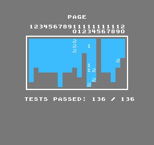

# AprNes - C# NES Emulator

> 🇺🇸 English | [🇹🇼 繁體中文](#aprnes---c-nes-模擬器)

A cycle-accurate NES (Nintendo Entertainment System) emulator written in C#, developed in collaboration with AI (GitHub Copilot / Claude). The project achieves **perfect scores** on both the blargg and AccuracyCoin test suites.

## Links

- **Website**: https://www.baxermux.org/myemu/AprNes/
- **GitHub**: https://github.com/erspicu/AprNes
- **Blargg & misc test report**: https://www.baxermux.org/myemu/AprNes/report/index.html
- **AccuracyCoin report**: https://www.baxermux.org/myemu/AprNes/report/AccuracyCoin_report.html
- **Support**: https://buymeacoffee.com/baxermux

## Test Results

| Test Suite | Passed | Total | Rate |
|-----------|--------|-------|------|
| Blargg     | 174    | 174   | 100% |
| AccuracyCoin | 136  | 136   | 100% |



## About This Project

AprNes was developed as a learning and research project to understand the NES hardware at cycle-accurate precision. The entire development process — from architecture decisions to bug hunting — was done in close collaboration with AI assistants (GitHub Copilot CLI powered by Claude).

Key references used during development:

- **[Mesen2](https://github.com/SourMesen/Mesen2)** — A highly accurate multi-system emulator. Used extensively as a reference for DMA timing, PPU rendering, and APU behavior.
- **[TriCNES](https://github.com/erspicu/AprNes/tree/master/ref/TriCNES-main)** — An emulator written by the author of the AccuracyCoin test ROM. Studying TriCNES's source code was crucial for understanding precise CPU/DMA timing, particularly the DMC DMA load/reload countdown model that enabled achieving the perfect AccuracyCoin score.
- **[NESdev Wiki](https://www.nesdev.org/wiki/)** — The authoritative reference for NES hardware documentation.

## Directory Structure

### Core Emulator (AprNes/)

*   **`AprNes/NesCore/`** — Emulator core (platform-independent simulation layer).
    *   `CPU.cs` — MOS 6502 CPU (full instruction set, cycle-accurate interrupt timing).
    *   `PPU.cs` — Picture Processing Unit (dot-by-dot rendering, VBL/NMI 1-cycle delay model).
    *   `APU.cs` — Audio Processing Unit (5 channels, WaveOut output, DMC DMA).
    *   `MEM.cs` — Memory management, tick model (each Mem_r/Mem_w advances 3 PPU dots + 1 APU cycle).
    *   `IO.cs` — PPU/APU register read/write dispatch ($2000–$2007, $4000–$4017).
    *   `JoyPad.cs` — NES controller strobe/read emulation.
    *   `Main.cs` — Core initialization, run loop, SRAM access API.
    *   `Mapper/` — Cartridge mapper implementations (Mapper 0/1/2/3/4/5/7/11/66/71).
*   **`AprNes/UI/`** — Windows Forms UI.
    *   `AprNesUI.cs` — Main window (FPS throttle, SRAM save/load, controller events).
    *   `AprNes_ConfigureUI.cs` — Keyboard/gamepad key binding UI.
*   **`AprNes/tool/`** — System helpers and rendering libraries.
    *   `WaveOutPlayer.cs` — WinMM WaveOut audio output.
    *   `joystick.cs` — Dual-API gamepad input (DirectInput8 + XInput).
    *   `NativeRendering.cs` / `InterfaceGraphic.cs` — GDI direct rendering.
    *   `libXBRz.cs` / `LibScanline.cs` / `Scalex.cs` — Screen scaling filters.
*   **`AprNes/TestRunner.cs`** — Headless automated test runner ($6000 protocol, screen stability detection, CRC comparison).

### AOT / WASM Variants

*   **`AprNesAOT/`** — .NET Native AOT build (Windows native executable).
*   **`AprNesAOT10/`** — .NET 10 AOT build.
*   **`AprNesWasm/`** — Blazor WebAssembly build (runs in browser).
*   **`NesCoreNative/`** — NesCore exported as a native DLL bridge.

### Tests & Reports

*   **`nes-test-roms-master/`** — NES test ROM collection.
    *   `checked/` — 174 blargg test ROMs (CPU, PPU, APU, Mapper timing).
    *   `AccuracyCoin-main/` — AccuracyCoin accuracy scoring test (136 sub-tests).
*   **`report/`** — Auto-generated test reports.
    *   `index.html` — AprNes blargg report (with screenshots).
    *   `AccuracyCoin_report.html` — AccuracyCoin report.
    *   `TriCNES_report.html` — TriCNES comparison report (169/174).
*   **`bugfix/`** — Bug fix records (sorted by date, with root cause analysis).

### Reference Material (ref/)

*   **`ref/Mesen2-master/`** — Full Mesen2 source code (primary reference for DMA/PPU timing).
*   **`ref/TriCNES-main/`** — TriCNES source code (with added headless TestRunner; 136/136 AccuracyCoin).

### Scripts

| Script | Purpose |
|--------|---------|
| `build.bat` / `build.ps1` | Build AprNes (.NET Framework 4.6.1) |
| `buildAot.bat` / `buildAot10.bat` | Build AOT variants |
| `build_wasm.bat` / `deploy_wasm.bat` | Build/deploy WASM variant |
| `run_tests.py` | Run all 174 blargg tests (Python, supports `-j 10` parallel) |
| `run_tests.sh` | Run all 174 blargg tests (Bash) |
| `run_tests_report.sh` | Generate blargg report (JSON + screenshots + HTML) |
| `run_tests_AccuracyCoin_report.sh` | Generate AccuracyCoin report |
| `run_tests_TriCNES.sh` | Run TriCNES comparison tests |
| `run_ac_test.sh` | Quick single AccuracyCoin page test |
| `benchmark.bat` / `benchmark.ps1` | Performance benchmark |

## Development Environment

*   **Language**: C#
*   **Framework**: .NET Framework 4.6.1 (Windows Forms)
*   **Compiler**: MSBuild 14.0 (VS2015 toolchain)
*   **Platform**: Windows x64
*   **Unsafe code**: Core uses raw pointers (`byte*`, `uint*`) for memory operations

## Quick Start

```bash
# Build
powershell -NoProfile -Command "& 'C:\Program Files (x86)\MSBuild\14.0\Bin\MSBuild.exe' AprNes.sln /p:Configuration=Debug /t:Rebuild /nologo"

# Launch GUI
AprNes/bin/Debug/AprNes.exe

# Run a test ROM (headless)
AprNes/bin/Debug/AprNes.exe --rom nes-test-roms-master/checked/cpu_timing_test6/cpu_timing_test.nes --wait-result --max-wait 30

# Run all 174 blargg tests
python run_tests.py -j 10
```

## Controller Support

| Device | API | Notes |
|--------|-----|-------|
| Generic USB gamepad / joystick | DirectInput8 (raw vtable) | Auto-enumerated, excludes XInput devices |
| Xbox 360 / One / Series | XInput (xinput1_4.dll) | Auto-detects players 0–3 |

## Supported Mappers

| Mapper | Representative Games |
|--------|---------------------|
| 0 (NROM) | Super Mario Bros., Donkey Kong |
| 1 (MMC1) | The Legend of Zelda, Castlevania II |
| 2 (UxROM) | Mega Man, Castlevania |
| 3 (CNROM) | Ninja Gaiden |
| 4 (MMC3) | Super Mario Bros. 3, TMNT |
| 5 (MMC5) | Earthworm Jim |
| 7 (AxROM) | Battle City |
| 11 | Golf Club |
| 66 (GxROM) | Super Mario Bros. / Duck Hunt |
| 71 | Bio-hazard Battle |

---

# AprNes - C# NES 模擬器

> [🇺🇸 English](#aprnes---c-nes-emulator) | 🇹🇼 繁體中文

使用 C# 開發的 NES（任天堂娛樂系統）cycle-accurate 模擬器，與 AI（GitHub Copilot / Claude）協作開發完成。在 blargg 與 AccuracyCoin 兩大測試套件上均達到**滿分**。

## 連結

- **官方網站**: https://www.baxermux.org/myemu/AprNes/
- **GitHub**: https://github.com/erspicu/AprNes
- **blargg 與其他零星測試 ROM 報告**: https://www.baxermux.org/myemu/AprNes/report/index.html
- **AccuracyCoin 報告**: https://www.baxermux.org/myemu/AprNes/report/AccuracyCoin_report.html
- **贊助**: https://buymeacoffee.com/baxermux

## 測試成績

| 測試套件 | 通過 | 總數 | 通過率 |
|---------|------|------|--------|
| Blargg 綜合測試 | 174 | 174 | 100% |
| AccuracyCoin | 136 | 136 | 100% |

## 專案背景

AprNes 是一個以追求 cycle-accurate 精度為目標的 NES 硬體模擬研究專案。整個開發過程——從架構設計到深度 bug 排查——都與 AI 助手（GitHub Copilot CLI，由 Claude 驅動）緊密協作完成。

開發過程中參考的重要資源：

- **[Mesen2](https://github.com/SourMesen/Mesen2)** — 高精度多系統模擬器。DMA timing、PPU 渲染與 APU 行為均以此為主要參考。
- **[TriCNES](https://github.com/erspicu/AprNes/tree/master/ref/TriCNES-main)** — 由 AccuracyCoin 測試 ROM 作者親自撰寫的模擬器。研讀 TriCNES 原始碼是突破 CPU/DMA 精確時序的關鍵，特別是 DMC DMA load/reload countdown 模型，使本專案最終達成 AccuracyCoin 滿分。
- **[NESdev Wiki](https://www.nesdev.org/wiki/)** — NES 硬體文件的權威參考來源。

## 目錄結構說明

### 核心程式碼 (AprNes/)

*   **`AprNes/NesCore/`** — 模擬器核心邏輯（純模擬層，不依賴任何系統/UI 函式庫）。
    *   `CPU.cs` — MOS 6502 處理器模擬（全指令集，含 cycle-accurate 中斷時序）。
    *   `PPU.cs` — 圖像處理單元模擬（逐 dot 渲染、VBL/NMI 1-cycle delay model）。
    *   `APU.cs` — 音效處理單元模擬（5 聲道、WaveOut 輸出、DMC DMA）。
    *   `MEM.cs` — 記憶體管理、tick model（每次 Mem_r/Mem_w 推進 3 PPU dots + 1 APU cycle）。
    *   `IO.cs` — PPU/APU 暫存器讀寫分派（$2000-$2007, $4000-$4017）。
    *   `JoyPad.cs` — NES 手把 strobe/read 模擬。
    *   `Main.cs` — 核心初始化、執行迴圈、SRAM 存取 API。
    *   `Mapper/` — 各類遊戲卡匣控制晶片實作（Mapper 0/1/2/3/4/5/7/11/66/71）。
*   **`AprNes/UI/`** — 基於 Windows Forms 的使用者介面。
    *   `AprNesUI.cs` — 主視窗（FPS 節流、SRAM 讀寫、手把事件）。
    *   `AprNes_ConfigureUI.cs` — 鍵盤/手把按鍵設定視窗。
*   **`AprNes/tool/`** — 系統層輔助工具與渲染函式庫。
    *   `WaveOutPlayer.cs` — WinMM WaveOut 音訊輸出。
    *   `joystick.cs` — 雙 API 手把輸入（DirectInput8 + XInput）。
    *   `NativeRendering.cs` / `InterfaceGraphic.cs` — GDI 直接繪圖。
    *   `libXBRz.cs` / `LibScanline.cs` / `Scalex.cs` — 畫面放大濾鏡。
*   **`AprNes/TestRunner.cs`** — 自動化測試執行器（headless 模式，支援 $6000 協定、畫面穩定偵測、CRC 比對）。

### AOT / WASM 變體

*   **`AprNesAOT/`** — .NET Native AOT 編譯版本（Windows 原生執行檔）。
*   **`AprNesAOT10/`** — .NET 10 AOT 編譯版本。
*   **`AprNesWasm/`** — Blazor WebAssembly 版本（瀏覽器內執行）。
*   **`NesCoreNative/`** — NesCore 匯出為原生 DLL 的橋接層。

### 測試與驗證

*   **`nes-test-roms-master/`** — NES 測試 ROM 集合。
    *   `checked/` — 174 個 blargg 測試 ROM（CPU、PPU、APU、Mapper 時序驗證）。
    *   `AccuracyCoin-main/` — AccuracyCoin 精確度評分測試（136 項子測試）。
*   **`report/`** — 自動產生的測試報告。
    *   `index.html` — AprNes blargg 測試報告（含截圖）。
    *   `AccuracyCoin_report.html` — AccuracyCoin 測試報告。
    *   `TriCNES_report.html` — TriCNES 對照測試報告（169/174）。
*   **`bugfix/`** — Bug 修復詳細記錄（按日期排序，含根因分析與驗證結果）。

### 參考資料 (ref/)

*   **`ref/Mesen2-master/`** — Mesen2 模擬器完整源碼（主要參考，DMA/PPU timing）。
*   **`ref/TriCNES-main/`** — TriCNES 模擬器源碼（含我們加入的 headless TestRunner，AC 136/136）。

### 設計文件 (MD/)

*   `AccuracyCoin_TODO.md` — AC 測試進度追蹤。
*   `p13_fix_plan.md` — P13 DMA 測試修復計畫。
*   `NesCore_refactor_proposal.md` — NesCore 系統層分離設計提案。
*   `DEVELOPMENT.md` / `TODO.md` — 開發備忘與待辦。

### 輔助工具 (tools/)

*   **`tools/page_getter/`** — 網頁下載工具（Playwright 無頭瀏覽器，繞過 Cloudflare）。
*   **`tools/KeyTest/`** — 鍵盤/手把輸入測試工具。
*   **`tools/JoyTest.cs`** — 獨立搖桿診斷工具。

### 腳本

| 腳本 | 用途 |
|------|------|
| `build.bat` / `build.ps1` / `do_build.bat` | 編譯 AprNes（.NET Framework 4.6.1） |
| `buildAot.bat` / `buildAot10.bat` | 編譯 AOT 版本 |
| `build_wasm.bat` / `deploy_wasm.bat` | 編譯/部署 WASM 版本 |
| `run_tests.py` | 跑 174 個 blargg 測試（Python，支援 `-j 10` 並行） |
| `run_tests.sh` | 跑 174 個 blargg 測試（Bash） |
| `run_tests_report.sh` | 產生 blargg 測試報告（JSON + 截圖 + HTML） |
| `run_tests_AccuracyCoin_report.sh` | 產生 AccuracyCoin 測試報告 |
| `run_tests_TriCNES.sh` | 跑 TriCNES 對照測試（174 ROM + 報告） |
| `run_ac_test.sh` | 快速跑單項 AC 測試 |
| `benchmark.bat` / `benchmark.ps1` | 效能基準測試 |

## 開發環境

*   **語言**: C#
*   **框架**: .NET Framework 4.6.1（Windows Forms）
*   **編譯器**: MSBuild 14.0（VS2015 工具鏈）
*   **平台**: Windows x64
*   **Unsafe code**: 核心使用原始指標（`byte*`, `uint*`）進行記憶體操作

## 快速開始

```bash
# 編譯
powershell -NoProfile -Command "& 'C:\Program Files (x86)\MSBuild\14.0\Bin\MSBuild.exe' AprNes.sln /p:Configuration=Debug /t:Rebuild /nologo"

# 啟動 GUI
AprNes/bin/Debug/AprNes.exe

# 跑測試 ROM（headless）
AprNes/bin/Debug/AprNes.exe --rom nes-test-roms-master/checked/cpu_timing_test6/cpu_timing_test.nes --wait-result --max-wait 30

# 跑全部 174 個測試
python run_tests.py -j 10
```

## 手把支援

| 裝置類型 | API | 說明 |
|---------|-----|------|
| 一般 USB 手把 / 老式搖桿 | DirectInput8（raw vtable） | 自動列舉，排除 XInput 裝置 |
| Xbox 360 / Xbox One / Xbox Series | XInput（xinput1_4.dll） | 自動偵測 player 0–3 |

## 支援的 Mapper

| Mapper | 代表遊戲 |
|--------|---------|
| 0 (NROM) | 超級瑪利歐兄弟、大金剛 |
| 1 (MMC1) | 薩爾達傳說、惡魔城 II |
| 2 (UxROM) | 洛克人、惡魔城 |
| 3 (CNROM) | 忍者龍劍傳 |
| 4 (MMC3) | 超級瑪利歐兄弟 3、忍者神龜 |
| 5 (MMC5) | 百戰天蟲 |
| 7 (AxROM) | 戰鬥城市 |
| 11 | 高爾夫俱樂部 |
| 66 (GxROM) | 超級馬利歐兄弟 / 打鴨子 |
| 71 | 生化戰士 |
