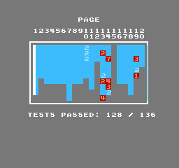

# AprNes - C# NES Emulator

> 🇺🇸 English | [🇹🇼 繁體中文](#aprnes---c-nes-模擬器) | Last updated: 2026-03-27

A cycle-accurate NES (Nintendo Entertainment System) emulator written in C#, developed in collaboration with AI (GitHub Copilot / Claude). The project achieves **perfect scores** on both the blargg and AccuracyCoin test suites.

## Links

- **Website**: https://www.baxermux.org/myemu/AprNes/
- **GitHub**: https://github.com/erspicu/AprNes
- **Blargg & misc test report**: https://www.baxermux.org/myemu/AprNes/report/index.html
- **AccuracyCoin report**: https://www.baxermux.org/myemu/AprNes/report/AccuracyCoin_report.html
- **Support**: https://buymeacoffee.com/baxermux

## Test Results

| Test Suite | Passed | Total | Rate |
|-----------|--------|-------|------|
| Blargg     | 174    | 174   | 100% |
| AccuracyCoin | 136  | 136   | 100% |



## About This Project

AprNes was developed as a learning and research project to understand the NES hardware at cycle-accurate precision. The entire development process — from architecture decisions to bug hunting — was done in close collaboration with AI assistants (GitHub Copilot CLI powered by Claude).

Key references used during development:

- **[Mesen2](https://github.com/SourMesen/Mesen2)** — A highly accurate multi-system emulator. Used extensively as a reference for DMA timing, PPU rendering, and APU behavior.
- **[TriCNES](https://github.com/erspicu/AprNes/tree/master/ref/TriCNES-main)** — An emulator written by the author of the AccuracyCoin test ROM. Studying TriCNES's source code was crucial for understanding precise CPU/DMA timing, particularly the DMC DMA load/reload countdown model that enabled achieving the perfect AccuracyCoin score.
- **[NESdev Wiki](https://www.nesdev.org/wiki/)** — The authoritative reference for NES hardware documentation.

## Directory Structure

### Core Emulator (AprNes/)

*   **`AprNes/NesCore/`** — Emulator core (platform-independent simulation layer).
    *   `CPU.cs` — MOS 6502 CPU (full instruction set, cycle-accurate interrupt timing).
    *   `PPU.cs` — Picture Processing Unit (dot-by-dot rendering, VBL/NMI 1-cycle delay model).
    *   `APU.cs` — Audio Processing Unit (5 channels, WaveOut output, DMC DMA).
    *   `MEM.cs` — Memory management, tick model (each Mem_r/Mem_w advances 3 PPU dots + 1 APU cycle).
    *   `IO.cs` — PPU/APU register read/write dispatch ($2000–$2007, $4000–$4017).
    *   `JoyPad.cs` — NES controller strobe/read emulation.
    *   `Main.cs` — Core initialization, run loop, SRAM access API.
    *   `Ntsc.cs` — NTSC composite video encoder/decoder (21.477 MHz waveform generation, FIR demodulation, SIMD batch YIQ-to-RGB).
    *   `CrtScreen.cs` — CRT electron beam optics (Gaussian scanline Bloom, curvature, phosphor persistence, SIMD pixel packing).
    *   `Mapper/` — Cartridge mapper implementations (30 mappers: NROM/MMC1/UxROM/CNROM/MMC3/MMC5/AxROM/MMC2/MMC4/ColorDreams/BandaiFCG/SS8806/VRC4/VRC2a/VRC2b/G-101/TC0190/Nina-1/RAMBO-1/H-3001/GxROM/Sunsoft#4/FME-7/Camerica/Irem78/VRC6/VRC7/Namco163/BandaiWRAM/Namco108).
*   **`AprNes/UI/`** — Windows Forms UI.
    *   `AprNesUI.cs` — Main window (FPS throttle, SRAM save/load, controller events).
    *   `AprNes_ConfigureUI.cs` — Keyboard/gamepad key binding UI.
*   **`AprNes/tool/`** — System helpers and rendering libraries.
    *   `WaveOutPlayer.cs` — WinMM WaveOut audio output.
    *   `joystick.cs` — Dual-API gamepad input (DirectInput8 + XInput).
    *   `NativeRendering.cs` / `InterfaceGraphic.cs` — GDI direct rendering.
    *   `libXBRz.cs` / `LibScanline.cs` / `Scalex.cs` — Screen scaling filters.
*   **`AprNes/TestRunner.cs`** — Headless automated test runner ($6000 protocol, screen stability detection, CRC comparison).

### Cross-Platform Variant (AprNesAvalonia/)

*   **`AprNesAvalonia/`** — Cross-platform build targeting .NET 10 + Avalonia 11 UI framework with TieredPGO.
    *   Shares the same `NesCore/` source as the WinForms edition (no code duplication).
    *   Targets Windows, Linux, macOS, and ARM (e.g. Raspberry Pi, Apple Silicon).
    *   `NesCoreNET/` — .NET 10 fork of NesCore with SIMD optimizations (platform-agnostic `Vector128<T>`).
    *   `MainWindow.axaml.cs` — Avalonia main window with WriteableBitmap rendering.
    *   `Views/ConfigWindow.axaml.cs` — Key binding and settings window.
    *   `TestRunner.cs` — Headless test runner (Avalonia Bitmap, no System.Drawing dependency).
    *   Build: `build_avalonia.bat` → `AprNesAvalonia/bin/Debug/net10.0/AprNesAvalonia.exe`

### WebAssembly Variant (AprNesWasm/)

*   **`AprNesWasm/`** — Blazor WebAssembly build (runs in browser, no install required).
    *   Build: `build_wasm.bat` / Deploy: `deploy_wasm.bat`

### Tests & Reports

*   **`nes-test-roms-master/`** — NES test ROM collection.
    *   `checked/` — 174 blargg test ROMs (CPU, PPU, APU, Mapper timing).
    *   `AccuracyCoin-main/` — AccuracyCoin accuracy scoring test (136 sub-tests).
*   **`reports/`** — Auto-generated test reports.
    *   `report/` — Blargg + AccuracyCoin reports for AprNes (WinForms).
        *   `index.html` — Blargg test report (with screenshots).
        *   `AccuracyCoin_report.html` — AccuracyCoin test report.
    *   `report-avalonia/` — AccuracyCoin report for AprNesAvalonia.

### Documentation (MD/)

*   **`MD/notes/`** — Development notes and planning documents.
    *   `AccuracyCoin_TODO.md` — AC test progress tracking.
    *   `DEVELOPMENT.md` / `TODO.md` — Development memos and backlog.
    *   `NesCore_refactor_proposal.md` — NesCore architecture separation proposal.
    *   and more...
*   **`MD/bugfix/`** — Bug fix records (sorted by date, with root cause analysis).
*   **`MD/Performance/`** — Performance benchmark records (`SIMD_TODO.md`, per-version `.md` logs).
*   **`MD/Mapper/`** — Mapper implementation status and documentation (`MAPPER_STATUS.md`).

### Reference Material (ref/)

*   **`ref/Mesen2-master/`** — Full Mesen2 source code (primary reference for DMA/PPU timing).
*   **`ref/TriCNES-main/`** — TriCNES source code (with added headless TestRunner; 136/136 AccuracyCoin).
*   **`ref/mapper/`** — Mapper implementation documentation and references.

### Tools (tools/)

*   **`tools/page_getter/`** — Web page downloader (Playwright headless browser, bypasses Cloudflare).
*   **`tools/KeyTest/`** — Keyboard/gamepad input test utility.
*   **`tools/JoyTest.cs`** — Standalone joystick diagnostics tool.
*   **`tools/gamepad_checker/`** — Gamepad input checker.
*   **`tools/knowledgebase/`** — Collected technical references and notes.

### Scripts

| Script | Purpose |
|--------|---------|
| `build.bat` / `build.ps1` / `do_build.bat` | Build AprNes (.NET Framework 4.8.1) |
| `build_avalonia.bat` | Build AprNesAvalonia (.NET 10 + Avalonia) |
| `build_wasm.bat` / `deploy_wasm.bat` | Build/deploy WASM variant |
| `run_tests.py` | Run all 174 blargg tests (Python, supports `-j 10` parallel) |
| `run_tests_avalonia.py` | Run all 174 blargg tests against AprNesAvalonia |
| `run_tests.sh` | Run all 174 blargg tests (Bash) |
| `run_tests_report.sh` | Generate blargg report (JSON + screenshots + HTML → `reports/report/`) |
| `run_tests_AccuracyCoin_report.sh` | Generate AccuracyCoin report (→ `reports/report/`) |
| `run_tests_AccuracyCoin_avalonia.sh` | Generate AccuracyCoin report for Avalonia build (→ `reports/report-avalonia/`) |
| `run_tests_TriCNES.sh` | Run TriCNES comparison tests |
| `run_ac_test.sh` | Quick single AccuracyCoin page test |

## Development Environment

*   **Language**: C#
*   **Framework**: .NET Framework 4.8.1 (AprNes) / .NET 10 (AprNesAvalonia)
*   **UI**: Windows Forms (AprNes) / Avalonia 11 cross-platform (AprNesAvalonia)
*   **Compiler**: MSBuild (VS2022) / dotnet CLI
*   **Platform**: Windows x64 (AprNes); Windows / Linux / macOS / ARM (AprNesAvalonia)
*   **Unsafe code**: Core uses raw pointers (`byte*`, `uint*`) for memory operations

## Quick Start

```bash
# Build AprNes (WinForms)
powershell -NoProfile -Command "& 'C:\Program Files\Microsoft Visual Studio\2022\Community\MSBuild\Current\Bin\MSBuild.exe' 'C:\ai_project\AprNes\AprNes\AprNes.csproj' /p:Configuration=Debug /p:Platform=x64 /nologo /v:minimal"

# Build AprNesAvalonia (.NET 10)
build_avalonia.bat

# Launch GUI
AprNes/bin/Debug/AprNes.exe
AprNesAvalonia/bin/Debug/net10.0/AprNesAvalonia.exe

# Run a test ROM (headless)
AprNes/bin/Debug/AprNes.exe --rom nes-test-roms-master/checked/cpu_timing_test6/cpu_timing_test.nes --wait-result --max-wait 30

# Run all 174 blargg tests
python run_tests.py -j 10
```

## Controller Support

| Device | API | Notes |
|--------|-----|-------|
| Generic USB gamepad / joystick | DirectInput8 (raw vtable) | Auto-enumerated, excludes XInput devices |
| Xbox 360 / One / Series | XInput (xinput1_4.dll) | Auto-detects players 0–3 |

## Supported Mappers (41 verified)

| Mapper | Representative Games |
|--------|---------------------|
| 0 (NROM) | Super Mario Bros., Donkey Kong |
| 1 (MMC1) | The Legend of Zelda, Metroid, Mega Man 2 |
| 2 (UxROM) | Mega Man, Castlevania, Ghosts 'n Goblins |
| 3 (CNROM) | Solomon's Key, Gradius |
| 4 (MMC3) | Super Mario Bros. 2/3, Mega Man 3–6 |
| 5 (MMC5) | Castlevania III, Gemfire, L'Empereur |
| 7 (AxROM) | Battletoads, Wizards & Warriors |
| 10 (MMC4) | Fire Emblem, Famicom Wars |
| 11 (Color Dreams) | Crystal Mines, Pesterminator |
| 18 (Jaleco SS8806) | Ninja Jajamaru (J), Pizza Pop! (J), Magic John (J) |
| 19 (Namco 163) | Splatterhouse (J), Rolling Thunder 2 (J) — with Namco 163 expansion audio |
| 24 (VRC6) | Akumajou Densetsu (J) — with VRC6 expansion audio |
| 25 (VRC4b/d) | Teenage Mutant Ninja Turtles (J), Gradius II (J) |
| 85 (VRC7) | Lagrange Point (J) — with OPLL (YM2413) FM synthesis audio |
| 21 (VRC4) | Wai Wai World 2 (J), Ganbare Goemon Gaiden 2 (J) |
| 22 (VRC2a) | TwinBee 3 (J) |
| 23 (VRC2b) | Contra (J), Getsufuu Maden (J) |
| 32 (Irem G-101) | Image Fight (J), Major League (J) |
| 33 (Taito TC0190) | Akira (J), Don Doko Don (J) |
| 66 (GxROM) | Dragon Ball (J), Gumshoe (U) |
| 65 (Irem H-3001) | Daiku no Gen San 2 (J) |
| 68 (Sunsoft #4) | After Burner II (J), Maharaja (J) |
| 69 (FME-7/5B) | Batman (J), Gimmick! (J) — with Sunsoft 5B expansion audio |
| 72 (Jaleco JF-17) | Pinball Quest (J), Moero!! Juudou Warriors (J) |
| 75 (VRC1) | Ganbare Goemon! (J), Jajamaru Ninpou Chou (J) |
| 77 (Napoleon Senki) | Napoleon Senki (J) |
| 79 (NINA-03/06) | Blackjack (AVE), Deathbots (AVE) |
| 80 (Taito X1-005) | Minelvaton Saga (J), Fudou Myouou Den (J) |
| 82 (Taito X1-017) | SD Keiji Blader (J), Harikiri Stadium (J) |
| 87 (Jaleco JF-09) | Argus (J), City Connection (J), The Goonies (J) |
| 89 (Sunsoft-2 Ikki) | Tenka no Goikenban - Mito Koumon (J) |
| 93 (Sunsoft-2) | Fantasy Zone (J), Shanghai (J) |
| 97 (Irem TAM-S1) | Kaiketsu Yanchamaru (J) |
| 118 (TxSROM) | Ys III (J), Armadillo (J) |
| 119 (TQROM) | High Speed (U) |
| 180 (Crazy Climber) | Crazy Climber (J) |
| 184 (Sunsoft-1) | Wing of Madoola (J), Atlantis no Nazo (J) |
| 152 (Bandai single-screen) | Arkanoid II (J) |
| 185 (CNROM+protect) | B-Wings (J), Bird Week (J), Mighty Bomb Jack (J) |
| 206 (Namco 108) | Karnov (J), Dragon Slayer 4 (J) |
| 228 (Action 52) | Cheetahmen II (U) |
| 232 (Camerica Quattro) | Quattro Adventure (U), Quattro Sports (U) |

---

# AprNes - C# NES 模擬器

> [🇺🇸 English](#aprnes---c-nes-emulator) | 🇹🇼 繁體中文 | 最後編修：2026-03-27

使用 C# 開發的 NES（任天堂娛樂系統）cycle-accurate 模擬器，與 AI（GitHub Copilot / Claude）協作開發完成。在 blargg 與 AccuracyCoin 兩大測試套件上均達到**滿分**。

## 連結

- **官方網站**: https://www.baxermux.org/myemu/AprNes/
- **GitHub**: https://github.com/erspicu/AprNes
- **blargg 與其他零星測試 ROM 報告**: https://www.baxermux.org/myemu/AprNes/report/index.html
- **AccuracyCoin 報告**: https://www.baxermux.org/myemu/AprNes/report/AccuracyCoin_report.html
- **贊助**: https://buymeacoffee.com/baxermux

## 測試成績

| 測試套件 | 通過 | 總數 | 通過率 |
|---------|------|------|--------|
| Blargg 綜合測試 | 174 | 174 | 100% |
| AccuracyCoin | 136 | 136 | 100% |

## 專案背景

AprNes 是一個以追求 cycle-accurate 精度為目標的 NES 硬體模擬研究專案。整個開發過程——從架構設計到深度 bug 排查——都與 AI 助手（GitHub Copilot CLI，由 Claude 驅動）緊密協作完成。

開發過程中參考的重要資源：

- **[Mesen2](https://github.com/SourMesen/Mesen2)** — 高精度多系統模擬器。DMA timing、PPU 渲染與 APU 行為均以此為主要參考。
- **[TriCNES](https://github.com/erspicu/AprNes/tree/master/ref/TriCNES-main)** — 由 AccuracyCoin 測試 ROM 作者親自撰寫的模擬器。研讀 TriCNES 原始碼是突破 CPU/DMA 精確時序的關鍵，特別是 DMC DMA load/reload countdown 模型，使本專案最終達成 AccuracyCoin 滿分。
- **[NESdev Wiki](https://www.nesdev.org/wiki/)** — NES 硬體文件的權威參考來源。

## 目錄結構說明

### 核心程式碼 (AprNes/)

*   **`AprNes/NesCore/`** — 模擬器核心邏輯（純模擬層，不依賴任何系統/UI 函式庫）。
    *   `CPU.cs` — MOS 6502 處理器模擬（全指令集，含 cycle-accurate 中斷時序）。
    *   `PPU.cs` — 圖像處理單元模擬（逐 dot 渲染、VBL/NMI 1-cycle delay model）。
    *   `APU.cs` — 音效處理單元模擬（5 聲道、WaveOut 輸出、DMC DMA）。
    *   `MEM.cs` — 記憶體管理、tick model（每次 Mem_r/Mem_w 推進 3 PPU dots + 1 APU cycle）。
    *   `IO.cs` — PPU/APU 暫存器讀寫分派（$2000-$2007, $4000-$4017）。
    *   `JoyPad.cs` — NES 手把 strobe/read 模擬。
    *   `Main.cs` — 核心初始化、執行迴圈、SRAM 存取 API。
    *   `Ntsc.cs` — NTSC 複合視訊編解碼器（21.477 MHz 波形生成、FIR 解調、SIMD 批次 YIQ 轉 RGB）。
    *   `CrtScreen.cs` — CRT 電子束光學模擬（高斯掃描線 Bloom、曲面變形、磷光持續、SIMD 像素打包）。
    *   `Mapper/` — 各類遊戲卡匣控制晶片實作（30 種 Mapper：NROM/MMC1/UxROM/CNROM/MMC3/MMC5/AxROM/MMC2/MMC4/ColorDreams/BandaiFCG/SS8806/VRC4/VRC2a/VRC2b/G-101/TC0190/Nina-1/RAMBO-1/H-3001/GxROM/Sunsoft#4/FME-7/Camerica/Irem78/VRC6/VRC7/Namco163/BandaiWRAM/Namco108）。
*   **`AprNes/UI/`** — 基於 Windows Forms 的使用者介面。
    *   `AprNesUI.cs` — 主視窗（FPS 節流、SRAM 讀寫、手把事件）。
    *   `AprNes_ConfigureUI.cs` — 鍵盤/手把按鍵設定視窗。
*   **`AprNes/tool/`** — 系統層輔助工具與渲染函式庫。
    *   `WaveOutPlayer.cs` — WinMM WaveOut 音訊輸出。
    *   `joystick.cs` — 雙 API 手把輸入（DirectInput8 + XInput）。
    *   `NativeRendering.cs` / `InterfaceGraphic.cs` — GDI 直接繪圖。
    *   `libXBRz.cs` / `LibScanline.cs` / `Scalex.cs` — 畫面放大濾鏡。
*   **`AprNes/TestRunner.cs`** — 自動化測試執行器（headless 模式，支援 $6000 協定、畫面穩定偵測、CRC 比對）。

### 跨平台版本 (AprNesAvalonia/)

*   **`AprNesAvalonia/`** — 跨平台版本，採用 .NET 10 + Avalonia 11 UI 框架，啟用 TieredPGO 最佳化。
    *   與 WinForms 版共用相同的 `NesCore/` 原始碼（無程式碼複製）。
    *   支援 Windows、Linux、macOS 及 ARM（如樹莓派、Apple Silicon）。
    *   `NesCoreNET/` — .NET 10 版 NesCore，含 SIMD 最佳化（平台無關的 `Vector128<T>`）。
    *   `MainWindow.axaml.cs` — Avalonia 主視窗，使用 WriteableBitmap 渲染。
    *   `Views/ConfigWindow.axaml.cs` — 按鍵設定與偏好設定視窗。
    *   `TestRunner.cs` — Headless 測試執行器（使用 Avalonia Bitmap，不依賴 System.Drawing）。
    *   建置：`build_avalonia.bat` → `AprNesAvalonia/bin/Debug/net10.0/AprNesAvalonia.exe`

### WebAssembly 版本 (AprNesWasm/)

*   **`AprNesWasm/`** — Blazor WebAssembly 版本（瀏覽器內執行，無需安裝）。
    *   建置：`build_wasm.bat` / 部署：`deploy_wasm.bat`

### 測試與驗證

*   **`nes-test-roms-master/`** — NES 測試 ROM 集合。
    *   `checked/` — 174 個 blargg 測試 ROM（CPU、PPU、APU、Mapper 時序驗證）。
    *   `AccuracyCoin-main/` — AccuracyCoin 精確度評分測試（136 項子測試）。
*   **`reports/`** — 自動產生的測試報告。
    *   `report/` — AprNes（WinForms）blargg + AccuracyCoin 報告。
        *   `index.html` — blargg 測試報告（含截圖）。
        *   `AccuracyCoin_report.html` — AccuracyCoin 測試報告。
    *   `report-avalonia/` — AprNesAvalonia 的 AccuracyCoin 報告。

### 設計文件 (MD/)

*   **`MD/notes/`** — 開發筆記與規劃文件。
    *   `AccuracyCoin_TODO.md` — AC 測試進度追蹤。
    *   `DEVELOPMENT.md` / `TODO.md` — 開發備忘與待辦事項。
    *   `NesCore_refactor_proposal.md` — NesCore 系統層分離設計提案。
    *   及其他規劃與研究文件。
*   **`MD/bugfix/`** — Bug 修復詳細記錄（按日期排序，含根因分析與驗證結果）。
*   **`MD/Performance/`** — 效能基準測試記錄（`SIMD_TODO.md`、各版本 `.md` 測試日誌）。
*   **`MD/Mapper/`** — Mapper 實作狀態與文件（`MAPPER_STATUS.md`）。

### 參考資料 (ref/)

*   **`ref/Mesen2-master/`** — Mesen2 模擬器完整源碼（主要參考，DMA/PPU timing）。
*   **`ref/TriCNES-main/`** — TriCNES 模擬器源碼（含我們加入的 headless TestRunner，AC 136/136）。
*   **`ref/mapper/`** — Mapper 實作文件與參考資料。

### 輔助工具 (tools/)

*   **`tools/page_getter/`** — 網頁下載工具（Playwright 無頭瀏覽器，繞過 Cloudflare）。
*   **`tools/KeyTest/`** — 鍵盤/手把輸入測試工具。
*   **`tools/JoyTest.cs`** — 獨立搖桿診斷工具。
*   **`tools/gamepad_checker/`** — 手把輸入檢測工具。
*   **`tools/knowledgebase/`** — 技術參考文件收藏。

### 腳本

| 腳本 | 用途 |
|------|------|
| `build.bat` / `build.ps1` / `do_build.bat` | 編譯 AprNes（.NET Framework 4.8.1） |
| `build_avalonia.bat` | 編譯 AprNesAvalonia（.NET 10 + Avalonia） |
| `build_wasm.bat` / `deploy_wasm.bat` | 編譯/部署 WASM 版本 |
| `run_tests.py` | 跑 174 個 blargg 測試（Python，支援 `-j 10` 並行） |
| `run_tests_avalonia.py` | 對 AprNesAvalonia 跑 174 個 blargg 測試 |
| `run_tests.sh` | 跑 174 個 blargg 測試（Bash） |
| `run_tests_report.sh` | 產生 blargg 測試報告（JSON + 截圖 + HTML → `reports/report/`） |
| `run_tests_AccuracyCoin_report.sh` | 產生 AccuracyCoin 測試報告（→ `reports/report/`） |
| `run_tests_AccuracyCoin_avalonia.sh` | 產生 Avalonia 版 AccuracyCoin 報告（→ `reports/report-avalonia/`） |
| `run_tests_TriCNES.sh` | 跑 TriCNES 對照測試（174 ROM） |
| `run_ac_test.sh` | 快速跑單項 AC 測試 |

## 開發環境

*   **語言**: C#
*   **框架**: .NET Framework 4.8.1（AprNes）/ .NET 10（AprNesAvalonia）
*   **UI**: Windows Forms（AprNes）/ Avalonia 11 跨平台（AprNesAvalonia）
*   **編譯器**: MSBuild（VS2022）/ dotnet CLI
*   **平台**: Windows x64（AprNes）；Windows / Linux / macOS / ARM（AprNesAvalonia）
*   **Unsafe code**: 核心使用原始指標（`byte*`, `uint*`）進行記憶體操作

## 快速開始

```bash
# 編譯 AprNes (WinForms)
powershell -NoProfile -Command "& 'C:\Program Files\Microsoft Visual Studio\2022\Community\MSBuild\Current\Bin\MSBuild.exe' 'C:\ai_project\AprNes\AprNes\AprNes.csproj' /p:Configuration=Debug /p:Platform=x64 /nologo /v:minimal"

# 編譯 AprNesAvalonia (.NET 10)
build_avalonia.bat

# 啟動 GUI
AprNes/bin/Debug/AprNes.exe
AprNesAvalonia/bin/Debug/net10.0/AprNesAvalonia.exe

# 跑測試 ROM（headless）
AprNes/bin/Debug/AprNes.exe --rom nes-test-roms-master/checked/cpu_timing_test6/cpu_timing_test.nes --wait-result --max-wait 30

# 跑全部 174 個測試
python run_tests.py -j 10
```

## 手把支援

| 裝置類型 | API | 說明 |
|---------|-----|------|
| 一般 USB 手把 / 老式搖桿 | DirectInput8（raw vtable） | 自動列舉，排除 XInput 裝置 |
| Xbox 360 / Xbox One / Xbox Series | XInput（xinput1_4.dll） | 自動偵測 player 0–3 |

## 支援的 Mapper（41 個通過人工驗證）

| Mapper | 代表遊戲 |
|--------|---------|
| 0 (NROM) | 超級瑪利歐兄弟、大金剛 |
| 1 (MMC1) | 薩爾達傳說、銀河戰士、洛克人 2 |
| 2 (UxROM) | 洛克人、惡魔城、鬼屋魔域 |
| 3 (CNROM) | 所羅門的鑰匙、乃木坂 |
| 4 (MMC3) | 超級瑪利歐兄弟 2/3、洛克人 3–6 |
| 5 (MMC5) | 惡魔城傳說、Gemfire、L'Empereur |
| 7 (AxROM) | 熱血格鬥、騎士精英 |
| 10 (MMC4) | 火焰紋章、FC 大戰 |
| 11 (Color Dreams) | Crystal Mines、Pesterminator |
| 18 (Jaleco SS8806) | 忍者じゃじゃ丸（日）、Pizza Pop!（日）、Magic John（日） |
| 19 (Namco 163) | Splatterhouse（日）、Rolling Thunder 2（日）— 含 Namco 163 擴展音效 |
| 24 (VRC6) | 悪魔城伝説（日）— 含 VRC6 擴展音效 |
| 25 (VRC4b/d) | 忍者龜（日）、沙羅曼蛇 II（日） |
| 85 (VRC7) | Lagrange Point（日）— 含 OPLL (YM2413) FM 合成音效 |
| 21 (VRC4) | Wai Wai World 2（日）、がんばれゴエモン外伝 2（日） |
| 22 (VRC2a) | TwinBee 3（日） |
| 23 (VRC2b) | 魂斗羅（日）、月風魔傳（日） |
| 32 (Irem G-101) | Image Fight（日）、Major League（日） |
| 33 (Taito TC0190) | Akira（日）、Don Doko Don（日） |
| 66 (GxROM) | 七龍珠（日）、Gumshoe (U) |
| 65 (Irem H-3001) | 大工の源さん 2（日） |
| 68 (Sunsoft #4) | After Burner II（日）、Maharaja（日） |
| 69 (FME-7/5B) | 蝙蝠俠（日）、Gimmick!（日） — 含 Sunsoft 5B 擴展音效 |
| 72 (Jaleco JF-17) | Pinball Quest（日）、Moero!! 柔道戰士（日） |
| 75 (VRC1) | がんばれゴエモン!（日）、じゃじゃ丸忍法帳（日） |
| 77 (Napoleon Senki) | Napoleon 戰記（日） |
| 79 (NINA-03/06) | Blackjack (AVE)、Deathbots (AVE) |
| 80 (Taito X1-005) | ミネルバトンサーガ（日）、不動明王伝（日） |
| 82 (Taito X1-017) | SD 刑事ブレイダー（日）、はりきりスタジアム（日） |
| 87 (Jaleco JF-09) | Argus（日）、City Connection（日）、The Goonies（日） |
| 89 (Sunsoft-2 Ikki) | 天下のご意見番 水戸黄門（日） |
| 93 (Sunsoft-2) | Fantasy Zone（日）、上海（日） |
| 97 (Irem TAM-S1) | 快傑やんちゃ丸（日） |
| 118 (TxSROM) | Ys III（日）、Armadillo（日） |
| 119 (TQROM) | High Speed (U) |
| 180 (Crazy Climber) | Crazy Climber（日） |
| 184 (Sunsoft-1) | 魔導拉之翼（日）、アトランチスの謎（日） |
| 152 (Bandai single-screen) | Arkanoid II（日） |
| 185 (CNROM+protect) | B-Wings（日）、Bird Week（日）、Mighty Bomb Jack（日） |
| 206 (Namco 108) | Karnov（日）、Dragon Slayer 4（日） |
| 228 (Action 52) | Cheetahmen II (U) |
| 232 (Camerica Quattro) | Quattro Adventure (U)、Quattro Sports (U) |
