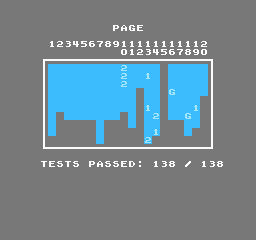

# AprNes - C# NES Emulator

> 🇺🇸 English | [🇹🇼 繁體中文](#aprnes---c-nes-模擬器) | Last updated: 2026-04-12

A cycle-accurate NES (Nintendo Entertainment System) emulator written in C#, developed in collaboration with AI (GitHub Copilot / Claude). The project achieves **perfect scores** on both the blargg and AccuracyCoin test suites.

## Project Status

AprNes will continue with additional mapper support before concluding its development on .NET Framework 4.8.1. Future development will move to a separate project built on **.NET 10 + Avalonia**.

This project was developed with AI assistance, with a focus on leveraging modern computing power to explore and implement concepts I wanted to try.

### TriCNES Timing Model Port

Although AprNes passed all 136 AccuracyCoin tests and the full blargg test suite, real-world testing revealed subtle PPU rendering inaccuracies in certain test ROMs (e.g., `scanline-a1` and `colorwin_ntsc.nes`). Investigation traced the root cause to insufficient precision in the PPU timing model. Attempts to patch the existing architecture proved impractical, leading to the decision to port TriCNES's complete timing architecture — including its per-master-clock execution model and fine-grained PPU state machine — as an equivalent reimplementation.

The TriCNES timing model is significantly more complex than a traditional NES emulator, with a comprehensive finite state machine covering every sub-cycle of PPU, CPU, APU, and DMA interaction. This thoroughness comes at a computational cost: on .NET Framework 4.8.1, the analog rendering pipeline (Ultra NTSC + CRT simulation) at 6x/8x resolution can dip below 60 FPS, despite extensive JIT-level optimization. Resolving this performance gap ultimately requires migrating to .NET 10, where TieredPGO and On-Stack Replacement can offset the overhead of this high-precision timing model.

## License

This project is released under the [**WTFPL**](http://www.wtfpl.net/) (Do What The Fuck You Want To Public License). You are free to reference, share, use, modify, or incorporate any code from this project into your own work — for any purpose whatsoever — with absolutely no restrictions.

I believe that AI-assisted development builds upon the collective knowledge shared by developers across the internet; it is only fair to give back in the same spirit. **I retain no copyright over any part of this project.**

See [`LICENSE`](LICENSE) for the full license text.

## Links

- **Website**: https://www.baxermux.org/myemu/AprNes/
- **GitHub**: https://github.com/erspicu/AprNes
- **Blargg & misc test report**: https://www.baxermux.org/myemu/AprNes/report/index.html
- **AccuracyCoin report**: https://www.baxermux.org/myemu/AprNes/report/AccuracyCoin_report.html
- **Support**: https://buymeacoffee.com/baxermux

## Test Results

| Test Suite | Passed | Total | Rate |
|-----------|--------|-------|------|
| Blargg (incl. PAL APU) | 184 | 184 | 100% |
| AccuracyCoin (Commit 03385dd) | 138 | 138 | 100% |



## About This Project

AprNes was developed as a learning and research project to understand the NES hardware at cycle-accurate precision. The entire development process — from architecture decisions to bug hunting — was done in close collaboration with AI assistants (GitHub Copilot CLI powered by Claude).

Key references used during development:

- **[Mesen2](https://github.com/SourMesen/Mesen2)** — A highly accurate multi-system emulator. Used extensively as a reference for DMA timing, PPU rendering, and APU behavior.
- **[TriCNES](https://github.com/erspicu/AprNes/tree/master/ref/TriCNES-main)** — An emulator written by the author of the AccuracyCoin test ROM. AprNes's entire timing architecture — per-master-clock execution model, PPU state machine, DMA bus model — was ported from TriCNES as an equivalent reimplementation to achieve maximum cycle-accuracy.
- **[NESdev Wiki](https://www.nesdev.org/wiki/)** — The authoritative reference for NES hardware documentation.

## Directory Structure

### Core Emulator (AprNes/)

*   **`AprNes/NesCore/`** — Emulator core (platform-independent simulation layer).
    *   `CPU.cs` — MOS 6502 CPU (full instruction set, cycle-accurate interrupt timing).
    *   `PPU.cs` — Picture Processing Unit (dot-by-dot rendering, VBL/NMI 1-cycle delay model).
    *   `APU.cs` — Audio Processing Unit (5 channels, WaveOut output, DMC DMA).
    *   `MEM.cs` — Memory management, tick model (each Mem_r/Mem_w advances 3 PPU dots + 1 APU cycle).
    *   `IO.cs` — PPU/APU register read/write dispatch ($2000–$2007, $4000–$4017).
    *   `JoyPad.cs` — NES controller strobe/read emulation.
    *   `Main.cs` — Core initialization, run loop, SRAM access API.
    *   `FDS.cs` — Famicom Disk System support (BIOS validation, disk I/O state machine, IRQ timer, wavetable + FM audio).
    *   `Ntsc.cs` — NTSC composite video encoder/decoder (21.477 MHz waveform generation, FIR demodulation, SIMD batch YIQ-to-RGB).
    *   `CrtScreen.cs` — CRT electron beam optics (Gaussian scanline Bloom, curvature, phosphor persistence, SIMD pixel packing).
    *   `Mapper/` — Cartridge mapper implementations (79 mappers, 72 verified).
*   **`AprNes/UI/`** — Windows Forms UI.
    *   `AprNesUI.cs` — Main window (FPS throttle, SRAM save/load, controller events).
    *   `AprNes_ConfigureUI.cs` — Keyboard/gamepad key binding UI.
*   **`AprNes/tool/`** — System helpers and rendering libraries.
    *   `WaveOutPlayer.cs` — WinMM WaveOut audio output.
    *   `joystick.cs` — Dual-API gamepad input (DirectInput8 + XInput).
    *   `NativeRendering.cs` / `InterfaceGraphic.cs` — GDI direct rendering.
    *   `libXBRz.cs` / `LibScanline.cs` / `Scalex.cs` — Screen scaling filters.
*   **`AprNes/TestRunner.cs`** — Headless automated test runner ($6000 protocol, screen stability detection, CRC comparison).

### Cross-Platform Variant (AprNesAvalonia/)

*   **`AprNesAvalonia/`** — Cross-platform build targeting .NET 10 + Avalonia 11 UI framework with TieredPGO.
    *   Shares the same `NesCore/` source as the WinForms edition (no code duplication).
    *   Targets Windows, Linux, macOS, and ARM (e.g. Raspberry Pi, Apple Silicon).
    *   `NesCoreNET/` — .NET 10 fork of NesCore with SIMD optimizations (platform-agnostic `Vector128<T>`).
    *   `MainWindow.axaml.cs` — Avalonia main window with WriteableBitmap rendering.
    *   `Views/ConfigWindow.axaml.cs` — Key binding and settings window.
    *   `TestRunner.cs` — Headless test runner (Avalonia Bitmap, no System.Drawing dependency).
    *   Build: `build_avalonia.bat` → `AprNesAvalonia/bin/Debug/net10.0/AprNesAvalonia.exe`

### WebAssembly Variant (AprNesWasm/)

*   **`AprNesWasm/`** — Blazor WebAssembly build (runs in browser, no install required).
    *   Build: `build_wasm.bat` / Deploy: `deploy_wasm.bat`

### Tests & Reports

*   **`nes-test-roms-master/`** — NES test ROM collection.
    *   `checked/` — 184 blargg test ROMs (CPU, PPU, APU, Mapper timing).
    *   `AccuracyCoin-main-20260410/` — AccuracyCoin accuracy scoring test (Commit 03385dd, 138 sub-tests).
*   **`reports/`** — Auto-generated test reports.
    *   `report/` — Blargg + AccuracyCoin reports for AprNes (WinForms).
        *   `index.html` — Blargg test report (with screenshots).
        *   `AccuracyCoin_report.html` — AccuracyCoin test report.
    *   `report-avalonia/` — AccuracyCoin report for AprNesAvalonia.

### Documentation (MD/)

*   **`MD/notes/`** — Development notes and planning documents.
    *   `AccuracyCoin_TODO.md` — AC test progress tracking.
    *   `DEVELOPMENT.md` / `TODO.md` — Development memos and backlog.
    *   `NesCore_refactor_proposal.md` — NesCore architecture separation proposal.
    *   and more...
*   **`MD/bugfix/`** — Bug fix records (sorted by date, with root cause analysis).
*   **`MD/Performance/`** — Performance benchmark records (`SIMD_TODO.md`, per-version `.md` logs).
*   **`MD/Mapper/`** — Mapper implementation status and documentation (`MAPPER_STATUS.md`).

### Reference Material (ref/)

*   **`ref/Mesen2-master/`** — Full Mesen2 source code (primary reference for DMA/PPU timing).
*   **`ref/TriCNES-main/`** — TriCNES source code, original version (with added headless TestRunner; 136/136 AccuracyCoin Commit 62ed684).
*   **`ref/TriCNES-main-20260410/`** — TriCNES updated version (build-only, no source; used as reference for SR Latch Pipeline and circuit-level timing).
*   **`ref/mapper/`** — Mapper implementation documentation and references.

### Tools (tools/)

*   **`tools/page_getter/`** — Web page downloader (Playwright headless browser, bypasses Cloudflare).
*   **`tools/KeyTest/`** — Keyboard/gamepad input test utility.
*   **`tools/JoyTest.cs`** — Standalone joystick diagnostics tool.
*   **`tools/gamepad_checker/`** — Gamepad input checker.
*   **`tools/knowledgebase/`** — Collected technical references and notes.

### Scripts

| Script | Purpose |
|--------|---------|
| `build.bat` / `build.ps1` / `do_build.bat` | Build AprNes (.NET Framework 4.8.1) |
| `build_avalonia.bat` | Build AprNesAvalonia (.NET 10 + Avalonia) |
| `build_wasm.bat` / `deploy_wasm.bat` | Build/deploy WASM variant |
| `run_tests.py` | Run all 184 blargg tests (Python, supports `-j 10` parallel) |
| `run_tests_avalonia.py` | Run all 184 blargg tests against AprNesAvalonia |
| `run_tests.sh` | Run all 184 blargg tests (Bash) |
| `run_tests_report.sh` | Generate blargg report (JSON + screenshots + HTML → `reports/report/`) |
| `run_tests_AccuracyCoin_report.sh` | Generate AccuracyCoin report (→ `reports/report/`) |
| `run_tests_AccuracyCoin_avalonia.sh` | Generate AccuracyCoin report for Avalonia build (→ `reports/report-avalonia/`) |
| `run_tests_TriCNES.sh` | Run TriCNES comparison tests |
| `run_ac_test.sh` | Quick single AccuracyCoin page test |

## Development Environment

*   **Language**: C#
*   **Framework**: .NET Framework 4.8.1 (AprNes) / .NET 10 (AprNesAvalonia)
*   **UI**: Windows Forms (AprNes) / Avalonia 11 cross-platform (AprNesAvalonia)
*   **Compiler**: MSBuild (VS2022) / dotnet CLI
*   **Platform**: Windows x64 (AprNes); Windows / Linux / macOS / ARM (AprNesAvalonia)
*   **Unsafe code**: Core uses raw pointers (`byte*`, `uint*`) for memory operations

## Quick Start

```bash
# Build AprNes (WinForms)
powershell -NoProfile -Command "& 'C:\Program Files\Microsoft Visual Studio\2022\Community\MSBuild\Current\Bin\MSBuild.exe' 'C:\ai_project\AprNes\AprNes\AprNes.csproj' /p:Configuration=Debug /p:Platform=x64 /nologo /v:minimal"

# Build AprNesAvalonia (.NET 10)
build_avalonia.bat

# Launch GUI
AprNes/bin/Debug/AprNes.exe
AprNesAvalonia/bin/Debug/net10.0/AprNesAvalonia.exe

# Run a test ROM (headless)
AprNes/bin/Debug/AprNes.exe --rom nes-test-roms-master/checked/cpu_timing_test6/cpu_timing_test.nes --wait-result --max-wait 30

# Run all 184 blargg tests
python run_tests.py -j 10
```

## Controller Support

| Device | API | Notes |
|--------|-----|-------|
| Generic USB gamepad / joystick | DirectInput8 (raw vtable) | Auto-enumerated, excludes XInput devices |
| Xbox 360 / One / Series | XInput (xinput1_4.dll) | Auto-detects players 0–3 |

## Supported Mappers (72 verified)

| Mapper | Representative Games |
|--------|---------------------|
| 0 (NROM) | Super Mario Bros., Donkey Kong |
| 1 (MMC1) | The Legend of Zelda, Metroid, Mega Man 2 |
| 2 (UxROM) | Mega Man, Castlevania, Ghosts 'n Goblins |
| 3 (CNROM) | Solomon's Key, Gradius |
| 4 (MMC3) | Super Mario Bros. 2/3, Mega Man 3–6 |
| 5 (MMC5) | Castlevania III, Gemfire, L'Empereur |
| 7 (AxROM) | Battletoads, Wizards & Warriors |
| 10 (MMC4) | Fire Emblem, Famicom Wars |
| 11 (Color Dreams) | Crystal Mines, Pesterminator |
| 20 (FDS) | Donkey Kong (FDS), Super Mario Bros. (FDS), Dracula II (FDS) — with FDS wavetable audio |
| 18 (Jaleco SS8806) | Ninja Jajamaru (J), Pizza Pop! (J), Magic John (J) |
| 19 (Namco 163) | Splatterhouse (J), Rolling Thunder 2 (J) — with Namco 163 expansion audio |
| 24 (VRC6) | Akumajou Densetsu (J) — with VRC6 expansion audio |
| 25 (VRC4b/d) | Teenage Mutant Ninja Turtles (J), Gradius II (J) |
| 85 (VRC7) | Lagrange Point (J) — with OPLL (YM2413) FM synthesis audio |
| 21 (VRC4) | Wai Wai World 2 (J), Ganbare Goemon Gaiden 2 (J) |
| 22 (VRC2a) | TwinBee 3 (J) |
| 23 (VRC2b) | Contra (J), Getsufuu Maden (J) |
| 32 (Irem G-101) | Image Fight (J), Major League (J) |
| 33 (Taito TC0190) | Akira (J), Don Doko Don (J) |
| 66 (GxROM) | Dragon Ball (J), Gumshoe (U) |
| 65 (Irem H-3001) | Daiku no Gen San 2 (J) |
| 68 (Sunsoft #4) | After Burner II (J), Maharaja (J) |
| 69 (FME-7/5B) | Batman (J), Gimmick! (J) — with Sunsoft 5B expansion audio |
| 72 (Jaleco JF-17) | Pinball Quest (J), Moero!! Juudou Warriors (J) |
| 75 (VRC1) | Ganbare Goemon! (J), Jajamaru Ninpou Chou (J) |
| 77 (Napoleon Senki) | Napoleon Senki (J) |
| 79 (NINA-03/06) | Blackjack (AVE), Deathbots (AVE) |
| 80 (Taito X1-005) | Minelvaton Saga (J), Fudou Myouou Den (J) |
| 82 (Taito X1-017) | SD Keiji Blader (J), Harikiri Stadium (J) |
| 87 (Jaleco JF-09) | Argus (J), City Connection (J), The Goonies (J) |
| 89 (Sunsoft-2 Ikki) | Tenka no Goikenban - Mito Koumon (J) |
| 93 (Sunsoft-2) | Fantasy Zone (J), Shanghai (J) |
| 97 (Irem TAM-S1) | Kaiketsu Yanchamaru (J) |
| 118 (TxSROM) | Ys III (J), Armadillo (J) |
| 119 (TQROM) | High Speed (U) |
| 180 (Crazy Climber) | Crazy Climber (J) |
| 184 (Sunsoft-1) | Wing of Madoola (J), Atlantis no Nazo (J) |
| 152 (Bandai single-screen) | Arkanoid II (J) |
| 185 (CNROM+protect) | B-Wings (J), Bird Week (J), Mighty Bomb Jack (J) |
| 206 (Namco 108) | Karnov (J), Dragon Slayer 4 (J) |
| 228 (Action 52) | Cheetahmen II (U) |
| 232 (Camerica Quattro) | Quattro Adventure (U), Quattro Sports (U) |
| 9 (MMC2) | Punch-Out!! (U) |
| 13 (CPROM) | Videomation (U) |
| 16 (Bandai FCG) | Dragon Ball (J), Dragon Ball Z (J), Magical Taruruuto-kun (J) |
| 26 (VRC6b) | Madara (J), Esper Dream 2 (J) — with VRC6 expansion audio |
| 29 (Sealie Computing) | Glider Expansion - Mad House (PD) |
| 34 (Nina-1) | Deadly Towers (U), Impossible Mission II (U) |
| 64 (RAMBO-1) | Shinobi (Tengen), Klax (Tengen) |
| 67 (Sunsoft-3) | Fantasy Zone II (J) |
| 70 (Bandai 74161/32) | Kamen Rider Club (J), GeGeGe no Kitaro (J) |
| 71 (Camerica) | Firehawk (U), Linus Spacehead (U) |
| 76 (Namco 109) | Megami Tensei (J), Battle City Hack V4 |
| 78 (Irem 74HC161/32) | Holy Diver (J), Cosmo Carrier (J) |
| 88 (Namco 118) | Dragon Spirit (J), Quinty (J) |
| 90 (JY Company) | Mortal Kombat 2 (Unl) |
| 95 (Namco 118 DxROM) | Dragon Buster (J) |
| 140 (Jaleco JF-11/14) | Doraemon (J), Bio Senshi Dan (J) |
| 154 (Namco 129) | Devil Man (J) |
| 159 (Bandai LZ93D50) | Dragon Ball Z - Kyoushuu Saiya Jin (J) |
| 74 (MMC3 + 2KB CHR-RAM bank 08-09) | Captain Tsubasa II (Chinese hacks), EverQuest (Ch) |
| 96 (Bandai Oeka Kids) | Oeka Kids - Anpanman no Hiragana Daisuki (J), Oeka Kids - Anpanman to Oekaki Shiyou!! (J) |
| 112 (Asder / Ntdec) | Cobra Mission, Fighting Hero III (Unl), Master Shooter, Chik Bik Ji Jin, Huang Di |
| 126 (PowerJoy multicart) | PowerJoy 84-in-1 (PJ-008) |
| 163 (Nanjing) | Final Fantasy VII (Ch), Diablo (NJ037), Da Hua Xi You, Chao Ji Ji Qi Ren Da Zhan A |
| 164 (Waixing 164) | Final Fantasy V (Unl), Pokemon Crystal (Ch), Pokemon Diamond (Ch), Darkseed, Digital Dragon |
| 176 (FK23C / Waixing multicart) | Super 12-in-1, 3-in-1 (ES-Q800C), 4-in-1 (BS-8088 / FK23Cxxxx / KT-220B) |
| 177 (Henggedianzi) | Xing He Zhan Shi, Wang Zi Fu Chou Ji, Mei Guo Fu Hao, Shang Gu Shen Jian, Xing Zhan Qing Yuan |
| 191 (MMC3 + 2KB CHR-RAM bank 0x80-0xFF wrap) | Double Dragon III (J/Chi_madcell), Downtown / Kunio-kun series (Chi_madcell), Mighty Final Fight (Chi_madcell), Q Boy (Sachen) |
| 211 (JY Company) | 2-in-1 Donkey Kong Country + Jungle Book (Unl), 2-in-1 DKC4 + Jungle Book 2 (Unl) |
| 241 (BxROM / Subor) | Hwang Shinwei 12-in-1, Russian Study Cartridge (7/14-in-1), Chao Ji Shu Biao Jin Ka (16-in-1), ABM Study Card |

---

# AprNes - C# NES 模擬器

> [🇺🇸 English](#aprnes---c-nes-emulator) | 🇹🇼 繁體中文 | 最後編修：2026-04-12

使用 C# 開發的 NES（任天堂娛樂系統）cycle-accurate 模擬器，與 AI（GitHub Copilot / Claude）協作開發完成。在 blargg 與 AccuracyCoin 兩大測試套件上均達到**滿分**。

## 專案狀態

AprNes 將在完成更多 Mapper 支援後，結束在 .NET Framework 4.8.1 平台上的開發。後續開發將轉移至以 **.NET 10 + Avalonia** 為基礎的獨立新專案。

本專案由 AI 輔助開發，偏向於利用現代電腦效能來實現一些我想嘗試的概念。

### TriCNES Timing 模型移植

儘管 AprNes 已通過全部 136 項 AccuracyCoin 測試與 blargg 完整測試集，在實際遊玩過程中仍發現部分 PPU 渲染畫面不夠正確（如 `scanline-a1` 與 `colorwin_ntsc.nes`）。追查後確認根因是 PPU timing 模型精度不足。由於在現有架構下難以修補相關問題，最終決定將 TriCNES 的完整 timing 架構——包含 per-master-clock 執行模型與精細的 PPU 有限狀態機——進行等價移植（reimplementation）。

TriCNES 的 timing 模型複雜度遠高於一般 NES 模擬器，其有限狀態機完整涵蓋了 PPU、CPU、APU、DMA 之間每個子週期的交互。這種精確性帶來了相當大的運算開銷：在 .NET Framework 4.8.1 上，即使經過大量 JIT 層級的效能優化，開啟類比渲染管線（Ultra NTSC + CRT 模擬）於 6x/8x 解析度時仍可能低於 60 FPS。要根本解決此效能瓶頸，最終需遷移至 .NET 10，借助 TieredPGO 與 On-Stack Replacement 來抵消高精度 timing 模型帶來的運算成本。

## 授權

本專案採用 [**WTFPL**](http://www.wtfpl.net/)（Do What The Fuck You Want To Public License）授權。您可以自由地參考、分享、使用、修改或將本專案的程式碼整合到您自己的作品中——用於任何目的——完全沒有任何限制。

我認為 AI 輔助開發建立在網路上每位開發者共享的知識之上，將成果回饋分享是理所當然的。**本專案不保留任何著作權。**

完整授權條款請見 [`LICENSE`](LICENSE)。

## 連結

- **官方網站**: https://www.baxermux.org/myemu/AprNes/
- **GitHub**: https://github.com/erspicu/AprNes
- **blargg 與其他零星測試 ROM 報告**: https://www.baxermux.org/myemu/AprNes/report/index.html
- **AccuracyCoin 報告**: https://www.baxermux.org/myemu/AprNes/report/AccuracyCoin_report.html
- **贊助**: https://buymeacoffee.com/baxermux

## 測試成績

| 測試套件 | 通過 | 總數 | 通過率 |
|---------|------|------|--------|
| Blargg 綜合測試（含 PAL APU） | 184 | 184 | 100% |
| AccuracyCoin（Commit 03385dd） | 138 | 138 | 100% |

## 專案背景

AprNes 是一個以追求 cycle-accurate 精度為目標的 NES 硬體模擬研究專案。整個開發過程——從架構設計到深度 bug 排查——都與 AI 助手（GitHub Copilot CLI，由 Claude 驅動）緊密協作完成。

開發過程中參考的重要資源：

- **[Mesen2](https://github.com/SourMesen/Mesen2)** — 高精度多系統模擬器。DMA timing、PPU 渲染與 APU 行為均以此為主要參考。
- **[TriCNES](https://github.com/erspicu/AprNes/tree/master/ref/TriCNES-main)** — 由 AccuracyCoin 測試 ROM 作者親自撰寫的模擬器。AprNes 的完整 timing 架構——per-master-clock 執行模型、PPU 有限狀態機、DMA 匯流排模型——均移植自 TriCNES，以等價翻寫的方式追求最高精確度。
- **[NESdev Wiki](https://www.nesdev.org/wiki/)** — NES 硬體文件的權威參考來源。

## 目錄結構說明

### 核心程式碼 (AprNes/)

*   **`AprNes/NesCore/`** — 模擬器核心邏輯（純模擬層，不依賴任何系統/UI 函式庫）。
    *   `CPU.cs` — MOS 6502 處理器模擬（全指令集，含 cycle-accurate 中斷時序）。
    *   `PPU.cs` — 圖像處理單元模擬（逐 dot 渲染、VBL/NMI 1-cycle delay model）。
    *   `APU.cs` — 音效處理單元模擬（5 聲道、WaveOut 輸出、DMC DMA）。
    *   `MEM.cs` — 記憶體管理、tick model（每次 Mem_r/Mem_w 推進 3 PPU dots + 1 APU cycle）。
    *   `IO.cs` — PPU/APU 暫存器讀寫分派（$2000-$2007, $4000-$4017）。
    *   `JoyPad.cs` — NES 手把 strobe/read 模擬。
    *   `Main.cs` — 核心初始化、執行迴圈、SRAM 存取 API。
    *   `FDS.cs` — Famicom Disk System 支援（BIOS 驗證、磁碟 I/O 狀態機、IRQ 計時器、wavetable + FM 音效）。
    *   `Ntsc.cs` — NTSC 複合視訊編解碼器（21.477 MHz 波形生成、FIR 解調、SIMD 批次 YIQ 轉 RGB）。
    *   `CrtScreen.cs` — CRT 電子束光學模擬（高斯掃描線 Bloom、曲面變形、磷光持續、SIMD 像素打包）。
    *   `Mapper/` — 各類遊戲卡匣控制晶片實作（79 種 Mapper，72 個通過人工驗證）。
*   **`AprNes/UI/`** — 基於 Windows Forms 的使用者介面。
    *   `AprNesUI.cs` — 主視窗（FPS 節流、SRAM 讀寫、手把事件）。
    *   `AprNes_ConfigureUI.cs` — 鍵盤/手把按鍵設定視窗。
*   **`AprNes/tool/`** — 系統層輔助工具與渲染函式庫。
    *   `WaveOutPlayer.cs` — WinMM WaveOut 音訊輸出。
    *   `joystick.cs` — 雙 API 手把輸入（DirectInput8 + XInput）。
    *   `NativeRendering.cs` / `InterfaceGraphic.cs` — GDI 直接繪圖。
    *   `libXBRz.cs` / `LibScanline.cs` / `Scalex.cs` — 畫面放大濾鏡。
*   **`AprNes/TestRunner.cs`** — 自動化測試執行器（headless 模式，支援 $6000 協定、畫面穩定偵測、CRC 比對）。

### 跨平台版本 (AprNesAvalonia/)

*   **`AprNesAvalonia/`** — 跨平台版本，採用 .NET 10 + Avalonia 11 UI 框架，啟用 TieredPGO 最佳化。
    *   與 WinForms 版共用相同的 `NesCore/` 原始碼（無程式碼複製）。
    *   支援 Windows、Linux、macOS 及 ARM（如樹莓派、Apple Silicon）。
    *   `NesCoreNET/` — .NET 10 版 NesCore，含 SIMD 最佳化（平台無關的 `Vector128<T>`）。
    *   `MainWindow.axaml.cs` — Avalonia 主視窗，使用 WriteableBitmap 渲染。
    *   `Views/ConfigWindow.axaml.cs` — 按鍵設定與偏好設定視窗。
    *   `TestRunner.cs` — Headless 測試執行器（使用 Avalonia Bitmap，不依賴 System.Drawing）。
    *   建置：`build_avalonia.bat` → `AprNesAvalonia/bin/Debug/net10.0/AprNesAvalonia.exe`

### WebAssembly 版本 (AprNesWasm/)

*   **`AprNesWasm/`** — Blazor WebAssembly 版本（瀏覽器內執行，無需安裝）。
    *   建置：`build_wasm.bat` / 部署：`deploy_wasm.bat`

### 測試與驗證

*   **`nes-test-roms-master/`** — NES 測試 ROM 集合。
    *   `checked/` — 184 個 blargg 測試 ROM（CPU、PPU、APU、Mapper 時序驗證，含 PAL APU）。
    *   `AccuracyCoin-main-20260410/` — AccuracyCoin 精確度評分測試（Commit 03385dd，138 項子測試）。
*   **`reports/`** — 自動產生的測試報告。
    *   `report/` — AprNes（WinForms）blargg + AccuracyCoin 報告。
        *   `index.html` — blargg 測試報告（含截圖）。
        *   `AccuracyCoin_report.html` — AccuracyCoin 測試報告。
    *   `report-avalonia/` — AprNesAvalonia 的 AccuracyCoin 報告。

### 設計文件 (MD/)

*   **`MD/notes/`** — 開發筆記與規劃文件。
    *   `AccuracyCoin_TODO.md` — AC 測試進度追蹤。
    *   `DEVELOPMENT.md` / `TODO.md` — 開發備忘與待辦事項。
    *   `NesCore_refactor_proposal.md` — NesCore 系統層分離設計提案。
    *   及其他規劃與研究文件。
*   **`MD/bugfix/`** — Bug 修復詳細記錄（按日期排序，含根因分析與驗證結果）。
*   **`MD/Performance/`** — 效能基準測試記錄（`SIMD_TODO.md`、各版本 `.md` 測試日誌）。
*   **`MD/Mapper/`** — Mapper 實作狀態與文件（`MAPPER_STATUS.md`）。

### 參考資料 (ref/)

*   **`ref/Mesen2-master/`** — Mesen2 模擬器完整源碼（主要參考，DMA/PPU timing）。
*   **`ref/TriCNES-main/`** — TriCNES 模擬器源碼，原始版本（含我們加入的 headless TestRunner；AccuracyCoin Commit 62ed684 136/136）。
*   **`ref/TriCNES-main-20260410/`** — TriCNES 更新版本（僅含建置檔，無原始碼；用於 SR Latch Pipeline 與電路級時序參考）。
*   **`ref/mapper/`** — Mapper 實作文件與參考資料。

### 輔助工具 (tools/)

*   **`tools/page_getter/`** — 網頁下載工具（Playwright 無頭瀏覽器，繞過 Cloudflare）。
*   **`tools/KeyTest/`** — 鍵盤/手把輸入測試工具。
*   **`tools/JoyTest.cs`** — 獨立搖桿診斷工具。
*   **`tools/gamepad_checker/`** — 手把輸入檢測工具。
*   **`tools/knowledgebase/`** — 技術參考文件收藏。

### 腳本

| 腳本 | 用途 |
|------|------|
| `build.bat` / `build.ps1` / `do_build.bat` | 編譯 AprNes（.NET Framework 4.8.1） |
| `build_avalonia.bat` | 編譯 AprNesAvalonia（.NET 10 + Avalonia） |
| `build_wasm.bat` / `deploy_wasm.bat` | 編譯/部署 WASM 版本 |
| `run_tests.py` | 跑 184 個 blargg 測試（Python，支援 `-j 10` 並行） |
| `run_tests_avalonia.py` | 對 AprNesAvalonia 跑 184 個 blargg 測試 |
| `run_tests.sh` | 跑 184 個 blargg 測試（Bash） |
| `run_tests_report.sh` | 產生 blargg 測試報告（JSON + 截圖 + HTML → `reports/report/`） |
| `run_tests_AccuracyCoin_report.sh` | 產生 AccuracyCoin 測試報告（→ `reports/report/`） |
| `run_tests_AccuracyCoin_avalonia.sh` | 產生 Avalonia 版 AccuracyCoin 報告（→ `reports/report-avalonia/`） |
| `run_tests_TriCNES.sh` | 跑 TriCNES 對照測試（184 ROM） |
| `run_ac_test.sh` | 快速跑單項 AC 測試 |

## 開發環境

*   **語言**: C#
*   **框架**: .NET Framework 4.8.1（AprNes）/ .NET 10（AprNesAvalonia）
*   **UI**: Windows Forms（AprNes）/ Avalonia 11 跨平台（AprNesAvalonia）
*   **編譯器**: MSBuild（VS2022）/ dotnet CLI
*   **平台**: Windows x64（AprNes）；Windows / Linux / macOS / ARM（AprNesAvalonia）
*   **Unsafe code**: 核心使用原始指標（`byte*`, `uint*`）進行記憶體操作

## 快速開始

```bash
# 編譯 AprNes (WinForms)
powershell -NoProfile -Command "& 'C:\Program Files\Microsoft Visual Studio\2022\Community\MSBuild\Current\Bin\MSBuild.exe' 'C:\ai_project\AprNes\AprNes\AprNes.csproj' /p:Configuration=Debug /p:Platform=x64 /nologo /v:minimal"

# 編譯 AprNesAvalonia (.NET 10)
build_avalonia.bat

# 啟動 GUI
AprNes/bin/Debug/AprNes.exe
AprNesAvalonia/bin/Debug/net10.0/AprNesAvalonia.exe

# 跑測試 ROM（headless）
AprNes/bin/Debug/AprNes.exe --rom nes-test-roms-master/checked/cpu_timing_test6/cpu_timing_test.nes --wait-result --max-wait 30

# 跑全部 184 個測試
python run_tests.py -j 10
```

## 手把支援

| 裝置類型 | API | 說明 |
|---------|-----|------|
| 一般 USB 手把 / 老式搖桿 | DirectInput8（raw vtable） | 自動列舉，排除 XInput 裝置 |
| Xbox 360 / Xbox One / Xbox Series | XInput（xinput1_4.dll） | 自動偵測 player 0–3 |

## 支援的 Mapper（72 個通過人工驗證）

| Mapper | 代表遊戲 |
|--------|---------|
| 0 (NROM) | 超級瑪利歐兄弟、大金剛 |
| 1 (MMC1) | 薩爾達傳說、銀河戰士、洛克人 2 |
| 2 (UxROM) | 洛克人、惡魔城、鬼屋魔域 |
| 3 (CNROM) | 所羅門的鑰匙、乃木坂 |
| 4 (MMC3) | 超級瑪利歐兄弟 2/3、洛克人 3–6 |
| 5 (MMC5) | 惡魔城傳說、Gemfire、L'Empereur |
| 7 (AxROM) | 熱血格鬥、騎士精英 |
| 10 (MMC4) | 火焰紋章、FC 大戰 |
| 11 (Color Dreams) | Crystal Mines、Pesterminator |
| 20 (FDS) | 大金剛（FDS）、超級瑪利歐兄弟（FDS）、德乃伯拉 II（FDS）— 含 FDS wavetable 音效 |
| 18 (Jaleco SS8806) | 忍者じゃじゃ丸（日）、Pizza Pop!（日）、Magic John（日） |
| 19 (Namco 163) | Splatterhouse（日）、Rolling Thunder 2（日）— 含 Namco 163 擴展音效 |
| 24 (VRC6) | 悪魔城伝説（日）— 含 VRC6 擴展音效 |
| 25 (VRC4b/d) | 忍者龜（日）、沙羅曼蛇 II（日） |
| 85 (VRC7) | Lagrange Point（日）— 含 OPLL (YM2413) FM 合成音效 |
| 21 (VRC4) | Wai Wai World 2（日）、がんばれゴエモン外伝 2（日） |
| 22 (VRC2a) | TwinBee 3（日） |
| 23 (VRC2b) | 魂斗羅（日）、月風魔傳（日） |
| 32 (Irem G-101) | Image Fight（日）、Major League（日） |
| 33 (Taito TC0190) | Akira（日）、Don Doko Don（日） |
| 66 (GxROM) | 七龍珠（日）、Gumshoe (U) |
| 65 (Irem H-3001) | 大工の源さん 2（日） |
| 68 (Sunsoft #4) | After Burner II（日）、Maharaja（日） |
| 69 (FME-7/5B) | 蝙蝠俠（日）、Gimmick!（日） — 含 Sunsoft 5B 擴展音效 |
| 72 (Jaleco JF-17) | Pinball Quest（日）、Moero!! 柔道戰士（日） |
| 75 (VRC1) | がんばれゴエモン!（日）、じゃじゃ丸忍法帳（日） |
| 77 (Napoleon Senki) | Napoleon 戰記（日） |
| 79 (NINA-03/06) | Blackjack (AVE)、Deathbots (AVE) |
| 80 (Taito X1-005) | ミネルバトンサーガ（日）、不動明王伝（日） |
| 82 (Taito X1-017) | SD 刑事ブレイダー（日）、はりきりスタジアム（日） |
| 87 (Jaleco JF-09) | Argus（日）、City Connection（日）、The Goonies（日） |
| 89 (Sunsoft-2 Ikki) | 天下のご意見番 水戸黄門（日） |
| 93 (Sunsoft-2) | Fantasy Zone（日）、上海（日） |
| 97 (Irem TAM-S1) | 快傑やんちゃ丸（日） |
| 118 (TxSROM) | Ys III（日）、Armadillo（日） |
| 119 (TQROM) | High Speed (U) |
| 180 (Crazy Climber) | Crazy Climber（日） |
| 184 (Sunsoft-1) | 魔導拉之翼（日）、アトランチスの謎（日） |
| 152 (Bandai single-screen) | Arkanoid II（日） |
| 185 (CNROM+protect) | B-Wings（日）、Bird Week（日）、Mighty Bomb Jack（日） |
| 206 (Namco 108) | Karnov（日）、Dragon Slayer 4（日） |
| 228 (Action 52) | Cheetahmen II (U) |
| 232 (Camerica Quattro) | Quattro Adventure (U)、Quattro Sports (U) |
| 9 (MMC2) | 乒乓拳擊!! (U) |
| 13 (CPROM) | Videomation (U) |
| 16 (Bandai FCG) | 七龍珠（日）、七龍珠Z（日）、Magical Taruruuto-kun（日） |
| 26 (VRC6b) | 摩陀羅（日）、Esper Dream 2（日）— 含 VRC6 擴展音效 |
| 29 (Sealie Computing) | Glider Expansion - Mad House (PD) |
| 34 (Nina-1) | Deadly Towers (U)、Impossible Mission II (U) |
| 64 (RAMBO-1) | 忍 Shinobi (Tengen)、Klax (Tengen) |
| 67 (Sunsoft-3) | Fantasy Zone II（日） |
| 70 (Bandai 74161/32) | 假面騎士俱樂部（日）、鬼太郎（日） |
| 71 (Camerica) | Firehawk (U)、Linus Spacehead (U) |
| 76 (Namco 109) | 女神轉生（日）、Battle City Hack V4 |
| 78 (Irem 74HC161/32) | Holy Diver（日）、宇宙船 Cosmo Carrier（日） |
| 88 (Namco 118) | Dragon Spirit（日）、Quinty（日） |
| 90 (JY Company) | Mortal Kombat 2 (Unl) |
| 95 (Namco 118 DxROM) | Dragon Buster（日） |
| 140 (Jaleco JF-11/14) | 哆啦A夢（日）、Bio Senshi Dan（日） |
| 154 (Namco 129) | 惡魔人（日） |
| 159 (Bandai LZ93D50) | 七龍珠Z 強襲賽亞人（日） |
| 74 (MMC3 + 2KB CHR-RAM bank 08-09) | 足球小將 II 系列中文化 hack、EverQuest（中） |
| 96 (Bandai Oeka Kids / 太鼓筆) | Anpanman 平假名（日）、Anpanman 畫圖（日） |
| 112 (Asder / Ntdec) | Cobra Mission、Fighting Hero III、Master Shooter、赤壁之戰、黃帝 |
| 126 (PowerJoy multicart) | PowerJoy 84-in-1 (PJ-008) |
| 163 (Nanjing / 南晶) | 太空戰士 VII（中）、暗黑破壞神 Diablo、大話西遊、超級機器人大戰 A |
| 164 (Waixing 164) | 太空戰士 V（中）、口袋水晶版、口袋鑽石版、Darkseed、Digital Dragon |
| 176 (FK23C / 外星多合一晶片) | 超級 12-in-1、3-in-1 (ES-Q800C)、4-in-1 (BS-8088 / FK23Cxxxx / KT-220B) |
| 177 (恒格電子 Henggedianzi) | 星河戰士、王子復仇記、美國富豪、上古神劍、星戰情緣 |
| 191 (MMC3 + 2KB CHR-RAM bank 0x80-0xFF wrap) | 雙截龍 III（中）、熱血物語／國夫君系列（中）、Mighty Final Fight（中）、Q Boy |
| 211 (JY Company 211) | 2-in-1 Donkey Kong Country + Jungle Book、2-in-1 DKC4 + Jungle Book 2 |
| 241 (BxROM / Subor) | 黃信維 12-in-1、俄羅斯學習卡帶 (7/14-in-1)、超級數學金卡 (16-in-1)、ABM 學習卡 |
